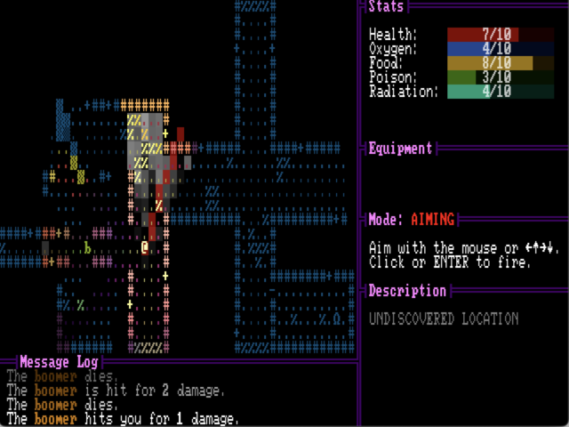
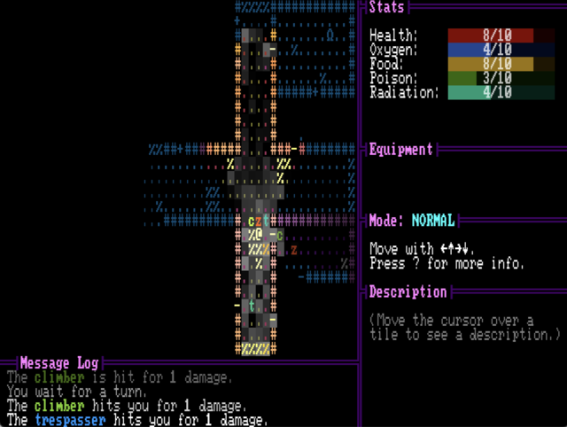
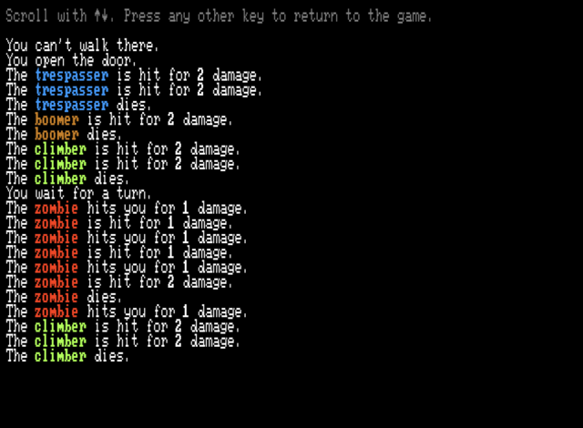

+++
title = "7 Day Roguelike 2024: Ranged Combat, Sound Effects, Message Log"
date = 2024-03-06
path = "7drl2024-day4"

[taxonomies]

[extra]
og_image = "aim.png"
+++

The main focus of the day was the combat system. This involved setting up the
control flow so that when the player presses the fire button the UI lets them
aim, and then commits the fire action after the user confirms their target.

<!-- more -->

Firing guns is accompanied by a sound effect. Rather than pre-recording sound
effects, sound effects are generated live using the same synthesizer that I use
for music. Using a synth means that some properties of the sound effects can be
randomized, so each instance of a sound effect sounds slightly different.

Finally I made a full screen UI for navigating the message log as there can be
some useful information in there and the regular game's UI only shows 4 lines at
a time.

Next step will be adding items, equipment, and organs.
