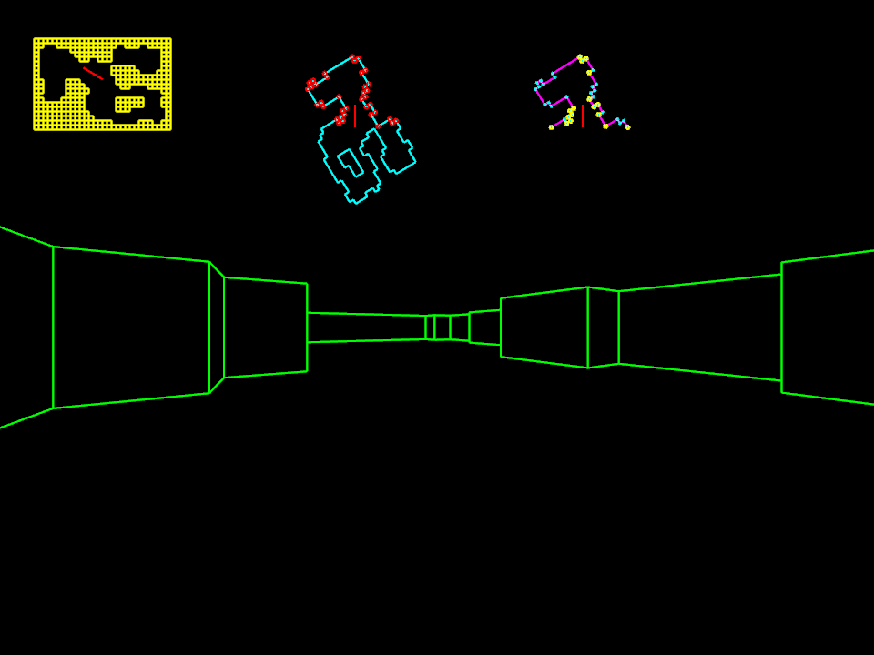
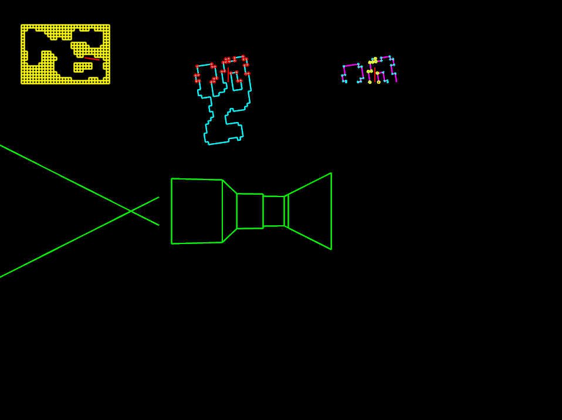

+++
title = "7 Day Roguelike 2025: Vector 3D Renderer"
date = 2025-03-01
path = "7drl2025-day1"

[taxonomies]

[extra]
og_image = "screenshot.png"
+++

This year my plan is to make a game that can be rendered using purely oscillographics.
Your computer will play sound out of the left and right speakers such that if you plotted the two waveforms on the X/Y axis it renders the game like an etch-a-sketch.
The game will also display the oscillographics directly just in case you don't have a 2D oscilloscope.

Here's my progress after a day of hacking.

This screenshot shows a 3D render of some level geometry.
The three images at the top show some debugging info. From left to right they
show the original grid-based level that was generated, a vector representation
of the same level with vertices in front of the player highlighted, and finally
the vector representation again but with all the geometry behind the player
removed and non-occluded vertices highlighted.

Rendering 3D graphics with a 2D oscilloscope means I need a 3D renderer that outputs 2D vector graphics.
This is unconventional; most 3D renderers rasterize their output and the rasterization is key to computing the visible parts of the scene.
Normally a data structure called a depth buffer keeps track of the distance
from the eye to each pixel during rendering, allowing near objects to be drawn
over the top of far objects during rasterization. Oscilloscopes draw lines -
not pixels - so I need to make sure that the only lines that get drawn are those that would be visible.

I'll go into more detail about the algorithm I came up with for visible area
detection when I have more time, after the 7DRL.

The hardest part was removing all the geometry behind the player. This was hard
because sometimes there's a wall that starts behind the player and ends in
front of the player. Perspective projection projects points behind the eye to
incorrect positions on the screen, so when some level geometry is both behind
and in front of the player it needs to be truncated so only the portion in
front of the player remains. Very fiddly and easy to get wrong.

Usually I use an existing engine for my 7DRL projects but this year I'm
basically starting from scratch. I'm using bevy to handle IO and draw lines,
and I'm going to use my [synthesizer](https://github.com/gridbugs/caw) for
generating sound. The closest thing I have to a starting point is [this
oscillographics demo](https://gridbugs.github.io/oscillographics-cube/) I made a few weeks before the jam
to test how hard it is to generate arbitrary images with oscillographics.

Next up I need to fix a few bugs in the renderer, then switch from rendering it
directly to rendering it with oscillographics.

Here's one of the renderer bugs:

