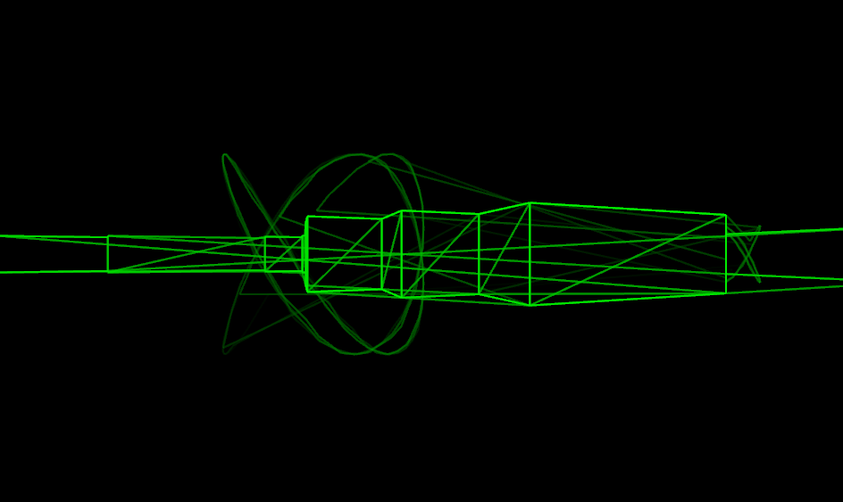

+++
title = "7 Day Roguelike 2025: Oscillographics"
date = 2025-03-02
path = "7drl2025-day2"

[taxonomies]

[extra]
og_image = "screenshot.png"
+++

Today I completed the renderer, fixing several major bugs and adding the
ability to render objects which can be occluded by walls. I implemented the
oscillagraphics renderer, so now when playing the game you hear sound that
changes depending on what's on the screen. Note the additional lines in the
rendered image which aren't part of the world geometry or objects. These are
necessary as when rendering with oscillographics it's impossible to "lift the
pen up".

Next up I need to implement collision detection so you can't walk through walls.
