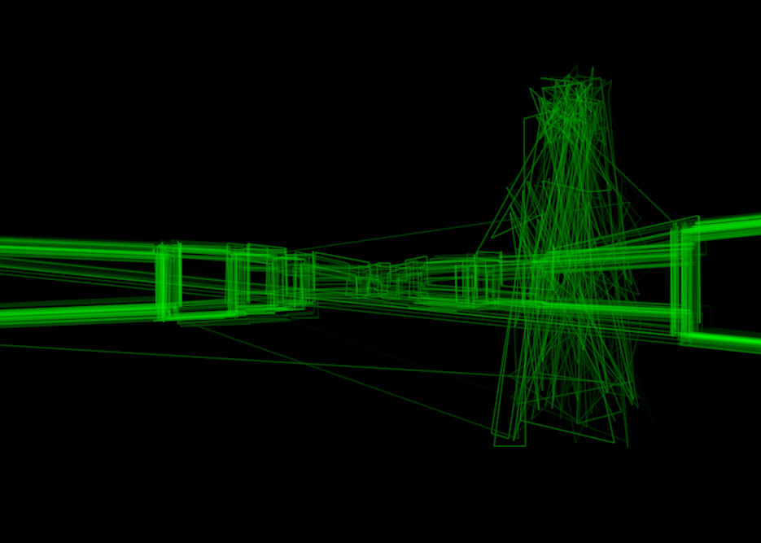

+++
title = "7 Day Roguelike 2025: Collision Detection and Enemies"
date = 2025-03-03
path = "7drl2025-day3"

[taxonomies]

[extra]
og_image = "screenshot.png"
+++

I added a quick and dirty implementation of collision handling for the player
character. Then I added some enemy types: a ghost and a slug. The ghost can
walk through walls and causes the image to become noisy the closer it gets to
you. The slug can't walk through walls and moves faster. Both are rendered with oscillographics.

Here's how the ghost looks:

I also added a death screen simulating how a CRT looks when it switches off
with the image collapsing to a horizontal line, then to a dot. For now the
player dies if they touch an enemy.

I want to add a couple more enemies including one that only moves while you're
not looking at it, weeping angel style.

In terms of gameplay, the game is mostly going to be about avoiding different
types of enemies as you navigate a dungeon and collect items. Rather than a
vertical dungeon I'm thinking there'll be a central hub with passages leading
to three distinct dungeons. The player will need to explore each dungeon and
collect an artifact from each one. There are some pretty oscillographic
patterns that I want to include in the game, and these can be the different
artifacts.

A central hub serves several purposes, gameplay wise. Firstly I'm trying to
make the game feel scary. A relatively safe central hub allows players brief
periods of calm in between more stressful moments in the dungeons. The contrast
will help make the dungeon sections feel more intense. The second purpose is
that it will allow the final goal of the game - gather the artifacts to open
the door - be visible from the start, in the form of the locked door.

Finally a central hub means that I don't have to worry about how to communicate
to the player that they are going down stairs. I can't display text, and the
renderer can only display vertical walls and "cardboard cutout" images which
I'm using for enemies and items. I can't think of an elegant way to display
stairs or similar within these constraints.

Once you gather all the artifacts, a door will open and then on the other side
is either the end of the game or a boss fight if I get time.

Maybe I'll also include some spells or something so the game can have some
character progression and to add another dimension to evading the enemies or
maybe even killing the enemies.

Another stretch goal is rendering text so the game can display some flavour
text or UI. This is a prerequisite for adding spells or increasing the player's
health above 1 as otherwise it will be hard to display info about available
spells or hit points.

So, the plan for the rest of the week, roughly in order, is:
 1. Generate the full map with three dungeons connected to a central hub.
 1. Add artifacts in each dungeon and make it so the game detects when an
    artifact is returned to the hub.
 1. Add a locked door that opens when all the artifacts have been gathered. At
    first, walking through the door ends the game and winning the game is
    implied by this.
 1. Text rendering.
 1. Display a message hinting what the player needs to do (gather 3 artifacts to open the door).

Then depending on how much time I have left and how the game feels I'll decide
whether to add new mechanics like player upgrades, spells, a boss fight, etc.
