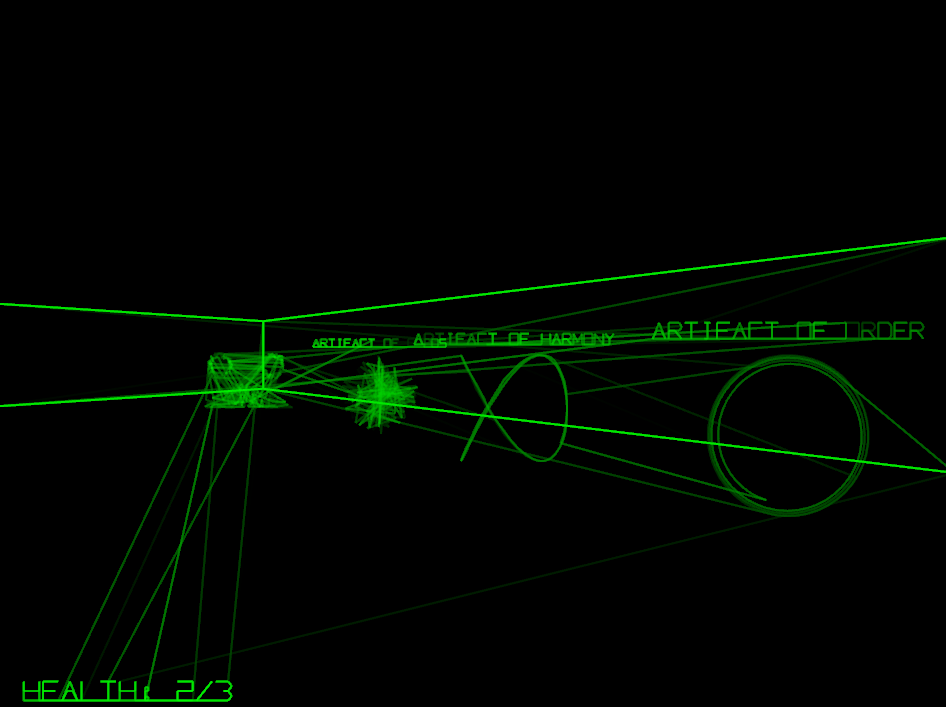

+++
title = "7 Day Roguelike 2025: Text, Item Labels, Central Hub"
date = 2025-03-04
path = "7drl2025-day4"

[taxonomies]

[extra]
og_image = "screenshot.png"
+++

I added text to my engine to enable rendering a HUD and labels on items. This
required describing each uppercase letter, digit, and some other symbols, as a list of
coordinates. Like everything else in the game, text is rendered with
oscillographics. I also added a couple of new oscillographic patterns which I'm
using to represent the artifacts the player needs to collect. The health
display in the HUD is currently just a placeholder - there's no damage system
yet.

I also extended the level generator to generate three dungeons connected by a central hub.

Next up I'll implement the mechanic of collecting the artifacts, add a final
door to the central hub that opens once each artifact has been collected, and
add some end text when the player walks through the door. After that the basic
skeleton of the game will be done, and I'll spend the remainder of the jam
adding more content and mechanics.
