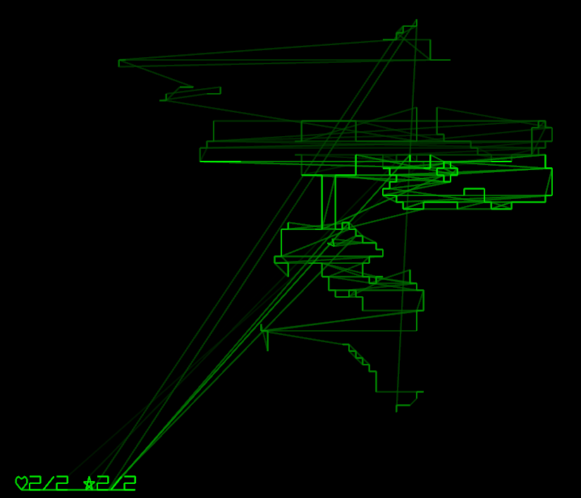
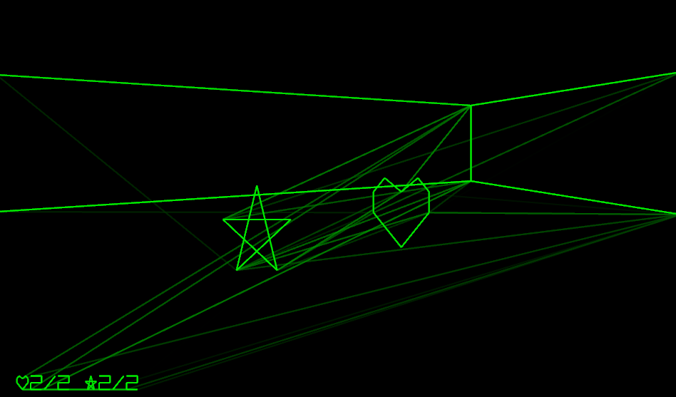
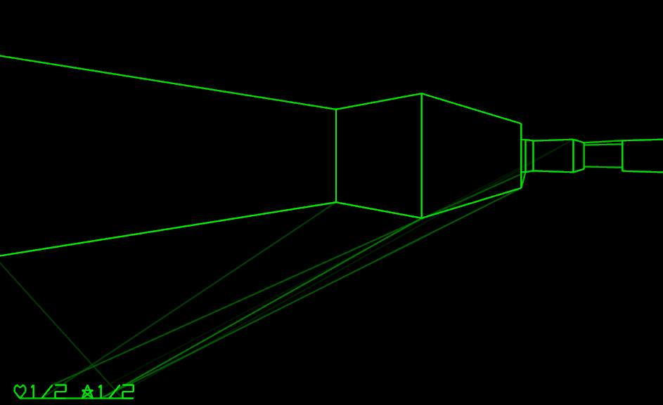
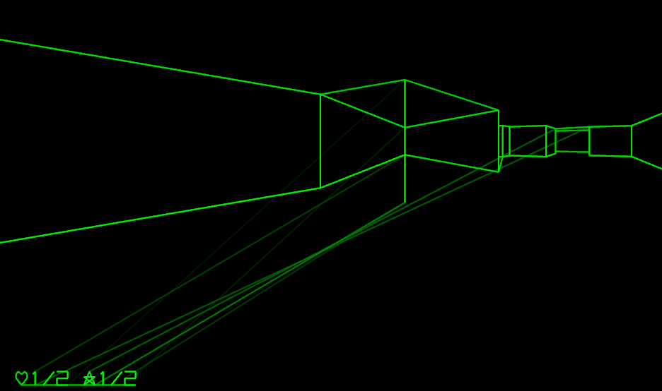

+++
title = "7 Day Roguelike 2025: Map, Pickups"
date = 2025-03-05
path = "7drl2025-day5"

[taxonomies]

[extra]
og_image = "map.png"
+++

Tonight I added a map mode (still rendered with oscillographics of course). It
only shows walls you have already seen.

I also added some basic items for restoring health and mana.

When you walk into an enemy you now take damage rather than instantly dying,
and there's an animation that plays where the image gets fuzzy for a second
after taking damage. The player has a period of invulnerability after taking
damage so they don't immediately take more damage from the same source.

I also spent several hours tracking down a bug where some corners would appear to pop inside out when viewed from certain angles. A scene like this:

...would appear like this:

The problem was related to how geometry is split so that the only walls
considered for rendering are those in front of the player, and walls with
components both in front of and behind the player are clipped so just the
portion in front of the player remains. Under some conditions a connected
series of walls would be separated such that the engine sees some corners as
two ends of two disconnected walls rather than the corner between a pair of
connected walls, which violated some other assumptions made elsewhere in the
engine resulting in inside-out looking walls.
