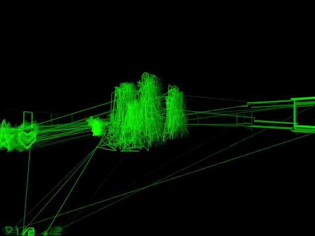

+++
title = "7 Day Roguelike 2025: Putting it all together"
date = 2025-03-06
path = "7drl2025-day6"

[taxonomies]

[extra]
og_image = "screenshot.png"
+++

After tonight I have the full game loop working. The dungeons are populated
with items and enemies, and when you collect all the artifacts and return to
the hub, the room starts shaking and a door opens that leads to a corridor with
"The End" written at the end. The bones are all there, and I have one more day
to polish and add content.

The three areas I'll focus on tomorrow will be:
 - Adding upgrades including spells to help evade and survive enemies.
 - More enemy types. I'd like 2 more types of enemy, with a new enemy type
   spawning each time you collect an artifact.
 - More variety of dungeons. Ideally each dungeon would be generated by a
   distinct algorithm.
