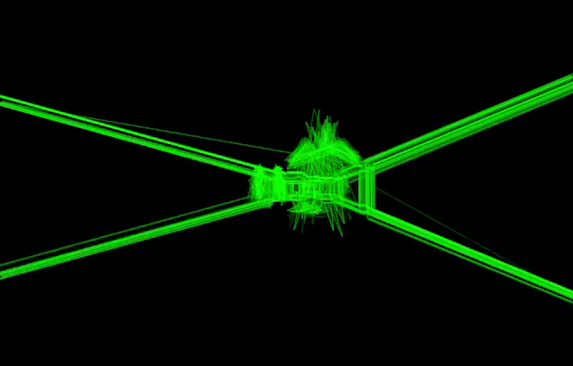
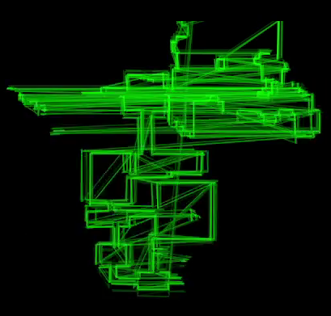
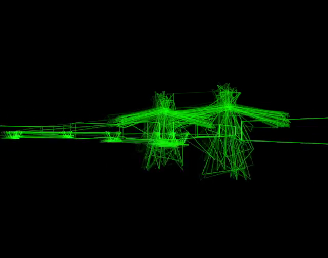

+++
title = "7 Day Roguelike 2025: Success!"
date = 2025-03-07
path = "7drl2025-day7"

[taxonomies]

[extra]
og_image = "screenshot1.png"
+++

The game is finished. [Play it on itch.io.](https://gridbugs.itch.io/scope-creep)

I made a bunch of changes tonight. Notably, I removed the HUD and mana. I was
originally going to add upgrades and spells, but I decided that giving the
player a bunch of abilities will detract from the feeling of dread I want them
to feel while playing Scope Creep. Instead, the player remains week while the
dungeon gets progressively more dangerous each time they collect an orb.

I added two new types of enemy. After collecting the second orb, the game
spawns a bunch of weeping-angel-style enemies which move faster the less
directly you look at them, and move very fast while off-screen. After
collecting the final orb, the game spawns the "Ghost King" right behind you.
It's fast, can move through walls, and is the only enemy that can chase you
into the hub area.

I spent a few hours playtesting and recording video and cut together [a trailer](https://www.youtube.com/watch?v=Uc4z52vJHkA).
I made some balancing adjustments, took a bunch of screenshots for the itch.io page, and submitted the game.

I plan on writing another post or two about the algorithms that I came up with
for rendering Scope Creep. I doubt I'm the first to design a completely
vector-based renderer for Wolfenstein-3D-esque faux 3D graphics but it's
certainly not a very commonly-used technique. It's definitely not the first
game to run on an oscilloscope, though it might be the first first-person game?

And I should really back up my claim about being able to render Scope Creep on
a real 2D analog oscilloscope!
