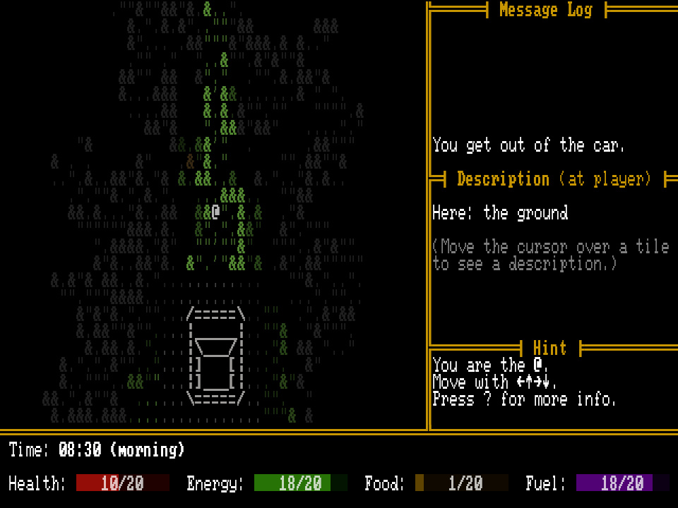

+++
title = "7 Day Roguelike 2026: Day 3"
date = 2026-03-02
path = "7drl2026-day3"

[taxonomies]

[extra]
og_image = "screenshot.jpg"
+++

Today I added a win condition, which is reaching the room containing the "wish granter", borrowing some lore from Roadside Picnic
which Pacific Drive was loosely based on. After driving sufficiently far the game generates the final level.

I still need to
add some indication of the distance remaining to the game's UI and add some variety to the terrain that gets generated
for regular gameplay.
