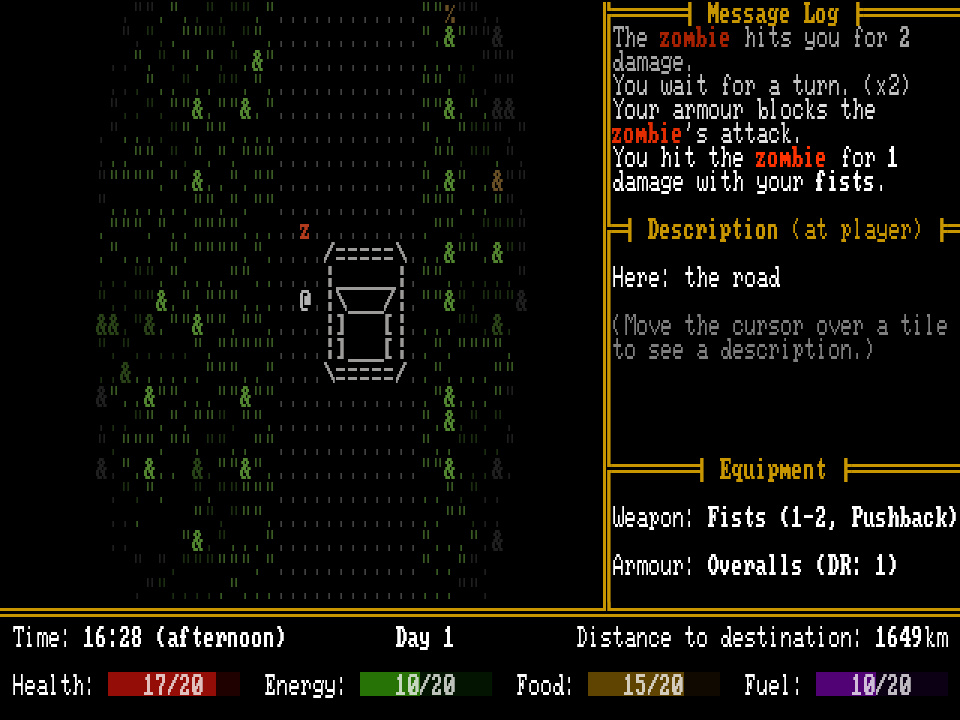

+++
title = "7 Day Roguelike 2026: Day 4"
date = 2026-03-03
path = "7drl2026-day4"

[taxonomies]

[extra]
og_image = "screenshot.jpg"
+++

Today I added the remaining distance and current day to the UI, and added a simple equipment system.

