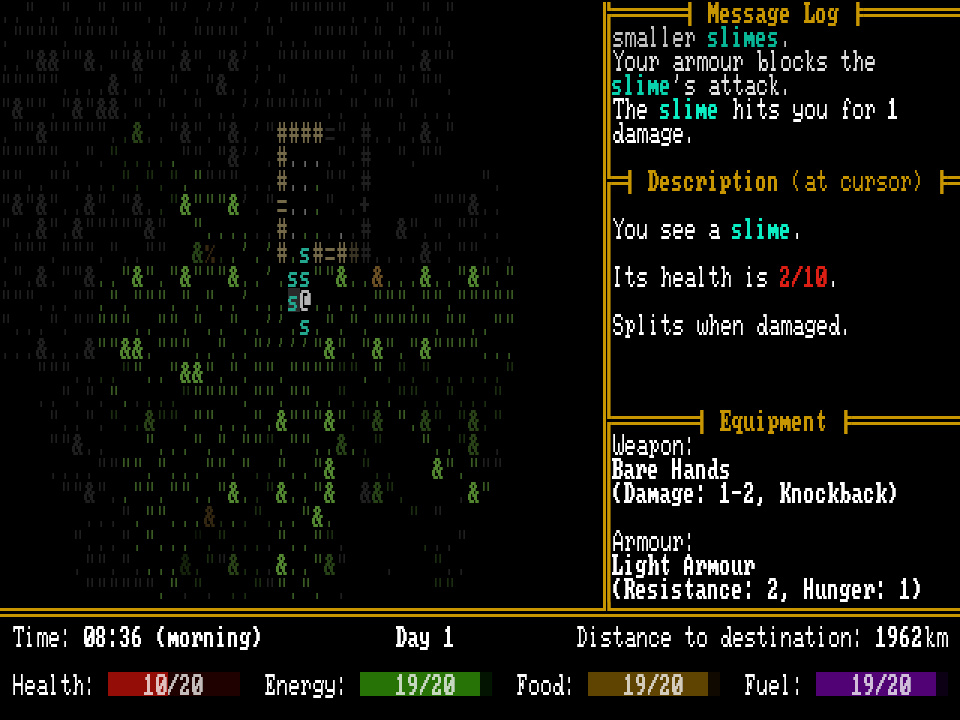

+++
title = "7 Day Roguelike 2026: Day 5"
date = 2026-03-04
path = "7drl2026-day5"

[taxonomies]

[extra]
og_image = "screenshot.jpg"
+++

A bunch of content additions tonight. I added a variety of melee weapons and
armour that interact with the games existing systems. Heavier armour requires
you to eat more food to support the extra weight of the armour. There's a high
damage axe which costs energy to use.

I also added a slime enemy that splits when attacked.

The plan for tomorrow is to add a new terrain generator (probably a city) and
populate the generated terrain with items and enemies. This should be enough to
get the game in a playable state, and then I'll have one more night to add more
content (hopefully a third terrain generator), polish, playtest, and balance.
