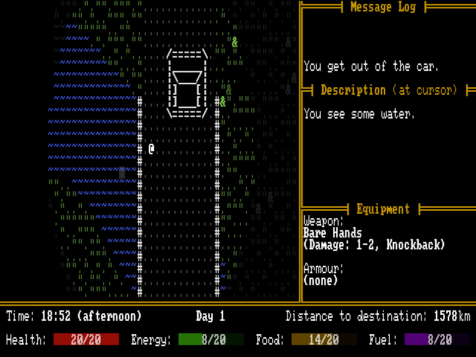

+++
title = "7 Day Roguelike 2026: Day 6"
date = 2026-03-05
path = "7drl2026-day6"

[taxonomies]

[extra]
og_image = "screenshot.jpg"
+++

Tonight I added some more terrain generators. There are now three different
types of terrain, and as you drive the current terrain periodically changes.
The two new types of terrain are a swamp and mountain pass. All three terrain
generators are wilderness areas. I was originally going to have a mix of
wilderness and urban areas but I've always found it hard to implement
procedural generation of urban areas and I don't think there's enough time left
in the jam to get it right.

The main task I still need to do is populating the terrain with enemies and items.
Tomorrow is the final day of the 7DRL and my plan is to populate the maps and playtest
to balance them. I should also probably add a couple more types of enemy as
currently there are only three.
