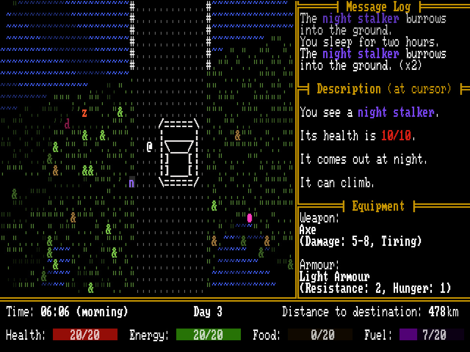

+++
title = "7 Day Roguelike 2026: Day 7"
date = 2026-03-06
path = "7drl2026-day7"

[taxonomies]

[extra]
og_image = "screenshot.jpg"
+++

Tonight I finished the game and [released](https://gridbugs.itch.io/road-closed) it on itch.io.
I spent the night working on populating maps, adding a few new enemy types, and then playtesting, balancing, and fixing bugs.

The result is playable and there's a steady difficulty curve requiring players to make decisions about whether to fight
or run away from an encounter, and whether they've scavenged enough in one area and should return to the car.
The presence of the car means that you can always escape an encounter if you can make it back to the car in one piece.
Most enemies can be fought on their own fairly easily but taking on more than one at a
time is dangerous. Character progression is a mix of finding better equipment and hoarding resources to use in emergencies.

I knew I was going to have a busy week during the 7DRL challenge week so the scope of Road Closed is deliberately quite limited.
I would have liked to add an upgrade system based on equipping mysterious artifacts like in the S.T.A.L.K.E.R franchise, or
add events that take place in the game's driving mode similar in FTL, but I didn't have time.
