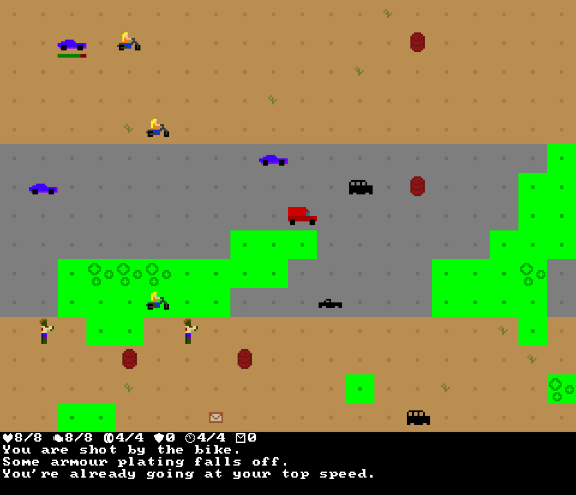

+++
title = "Apocalypse Post"
date = 2017-03-11T04:20:00+10:00
path = "apocalypse-post"

[taxonomies]
tags = ["roguelikes", "7drl"]
+++

Apocalypse Post is a procedurally-generated, turn-based tactical shooter set in a post-apocalyptic future, where you carry mail between survivor camps in your trusty delivery van, all the while fending off attacks from bandits and zombies. Between each delivery run, buy weapons and armour to upgrade your van to cope with ever-increasing numbers of enemies.

I made this game for the 2017 7 Day Roguelike game jam.

 - [Download](https://gridbugs.itch.io/apocalypse-post)
 - [Source](https://github.com/gridbugs/apocalypse-post)

