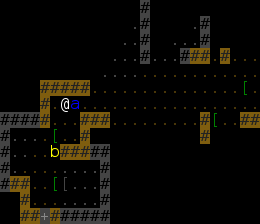

+++
title = "Bug Catcher"
date = 2016-02-09T23:49:01+10:00
path = "bugcatcher"

[taxonomies]
tags = ["roguelikes"]
+++

This is my first attempt at writing [one game a month](http://www.onegameamonth.com/). It's a turn-based
dungeon crawler in the style of traditional roguelikes. All the characters in the game are bugs. Each bug
has an ability and combat stats. You can "channel" a bug and gain access to its ability and stats.

[Play in browser](https://games.gridbugs.org/bugcatcher)

<!-- more -->
