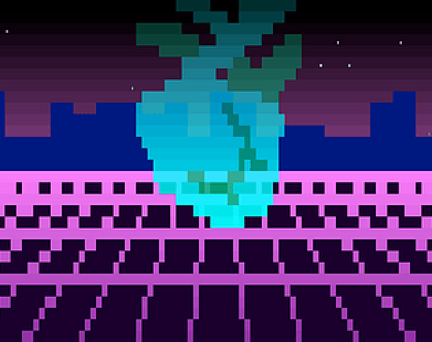
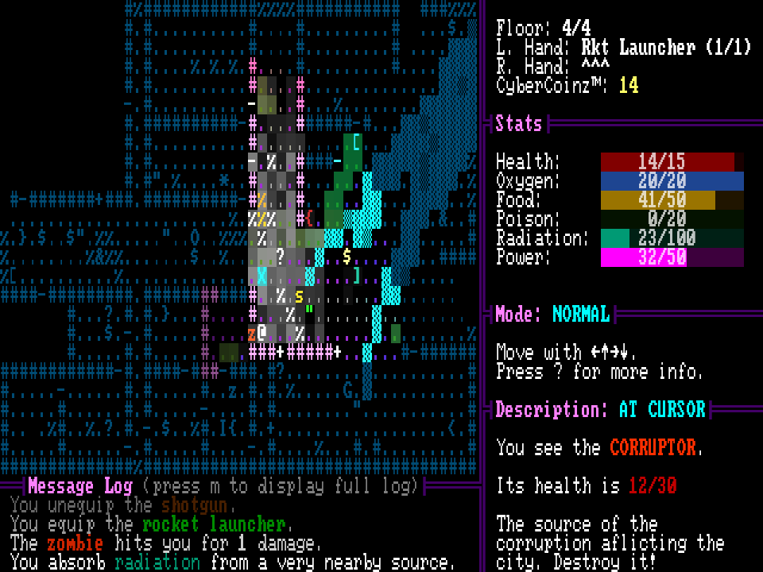
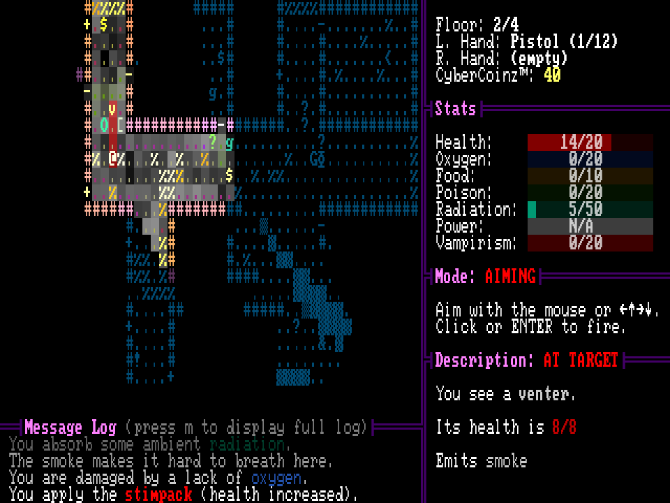
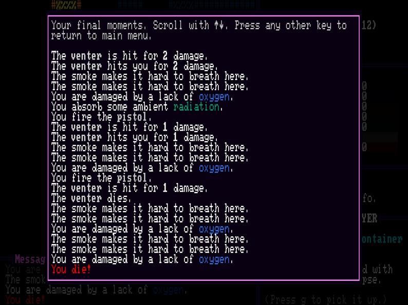

+++
title = "Electric Organ"
date = 2024-07-09
path = "electric-organ"

[taxonomies]
tags = ["roguelikes", "7drl"]

[extra]
og_image = "cover.png"
+++

Electric Organ is a traditional roguelike with an emphasis on ranged
combat. Character progression primarily takes the form of swapping out
your organs as they are damaged by the environment, and upgrading them
to make yourself strong enough to face the threats below the city.

It's my 9th entry into the [7 Day Roguelike game jam](https://7drl.com/). It placed 1st according to [roguetemple's leaderboard](https://roguetemple.com/7drl/2024/)!

Download or play in a web browser on its [itch.io page](https://gridbugs.itch.io/electric-organ).

The game is open source, and its source code can be found [here](https://github.com/gridbugs/electric-organ).

And the devlog I wrote while developing this game begins [here](@/devlogs/7drl2024-day1/index.md).

Electric Organ is by far the most complicated thing I have ever
built. It runs on an engine that I've been developing over the past 5
or so years, and the music is generated live by a synthesizer library
that I've been developing for several months. It features a particle
system, dynamic lighting, and procedural music and sound effects. Some
of this technology I repurposed from previous projects, but getting it
all to integrate together still took a lot of work.

It's also dense with gameplay systems, the foremost of which is
organs, where the player can add and remove organs from their bodies
for various effects. Additionally, organs can have traits such as
transient which causes the organ to vanish at a random point in the
future, and vampiric which means the organ only functions if you've
recently injected a blood vial.

There are vendors which sell organs, guns and ammo, and items. There
are 14 different items with different abilities. There are 9 different
types of enemy, with unique abilities, such as the venter
which emits smoke that makes it hard to breath, the snatcher which
steals items, and the climber which can pass over usually-impassable
debris. And there's a final boss with several abilities found on
regular enemies, as well as a teleport ability that activates at
certain damage thresholds, which serves to prolong the boss fight.

The combat system is a mix of ranged and melee. The game tracks the
weapon held in each hand. Some weapons require both hands. Plus, you
can install claws (a type of organ) which greatly increases melee
combat but means you can't hold anything in that hand. Getting hand
tracking to work was probably the most tedious part of the whole
project. The code is a mess, but it works.

I had a clear plan for the art style and gameplay going into the
week. I'm currently obsessed with synthesizers and I'm developing a
[rust synthesizer library](https://github.com/gridbugs/caw) and wanted
to showcase it in this year's 7DRL by procedurally generating the
music. The general vibe was largely inspired by the pulpy dystopian
city streets of John Carpenter's "Escape from New York", the aesthetic
violent nihilism of the game Hotline Miami 2, and the cyberpunk
setting of Akira.

The core mechanic of swapping out organs was originally inspired by
the artifact system in the Stalker FPS franchise, where the player can
equip magical items which usually had both a positive and negative
status effect. I thought it would be interesting if the player could
equip such items without being able to easily unequip them, so adding
an artifact would be a more significant choice. This original idea has
been muddied somewhat in its implementation in Electric Organ, but the
core mechanic of swapping and upgrading organs fits well with the
game's aesthetic and I'm still happy with how it turned out. One
criticism I have is that it's almost never worth it to harvest organs
from the enemies you kill in the game, so I'd be interested in finding
a way to motivate players to do that more.

I'm satisfied with how the 7DRL week went. I had an easier time
staying motivated than in the last few 7DRLs and managed to spend
almost every non-work waking hour during the week working on my
game. It feels like I'm hitting up against the limit of the
productivity I can achieve with my current tools. I say this every
year but I do want to keep working on Electric Organ now that the jam
is finished, both because I want to use it to improve my tools (or
experiment with new tools), and because I really like how the game
turned out and want to spend some time making it even better.

Once again, you can download or play Electric Organ on its [itch.io page](https://gridbugs.itch.io/electric-organ).
