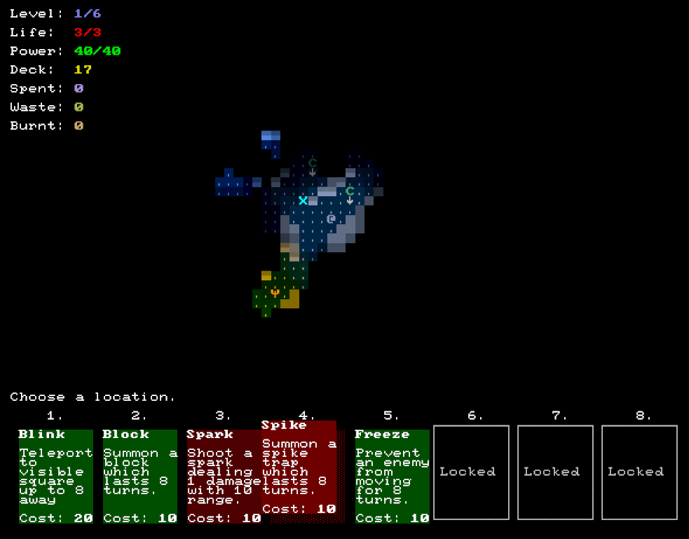

+++
title = "Get Well Soon"
date = 2019-03-10T22:00:00+10:00
path = "get-well-soon"

[taxonomies]
tags = ["roguelikes", "7drl"]
+++

Get Well Soon is a turn-based tactical dungeon crawler where all abilities are cards.
Maintain your deck as you fight through 6 procedurally-generated levels to
reach the bottom of the dungeon and reclaim what you have lost.

It is my entry in the 7 Day Roguelike game jam for 2019.

Play or download Get Well Soon on [its itch.io page](https://gridbugs.itch.io/get-well-soon).

View the [source code on github](https://github.com/gridbugs/gws/tree/7drl).

<!-- more -->

## Recap

### Sunday to Saturday

I started the jam on a Sunday and finished the following Saturday, working full
time Monday to Friday, and working on the game in the mornings before work, and
evenings, each day of the week. All previous years I've finished on Friday
instead. By finishing on a weekend, I was able to spend an entire day polishing
and adding content. I planned for this, focusing on engine and UI features
during the week. The most significant benefit was I was able to spend a long
time on Saturday play-testing the mostly-finished game, and tweaking balance,
which greatly improved the quality of the game.

### Wave Function Collapse

I use [WFC](@/blog/wave-function-collapse/index.md) to generate terrain, and then do a pass
over the output to add items and characters. Coaxing WFC to generate
interesting levels requires carefully restricting it from placing certain tiles
in certain locations. I spent much of the day before starting the 7drl messing
about with WFC to learn techniques for constraining the output of WFC, and fixed
a bug that caused restrictions to not always be enforced. I want to do more work
on my WFC library to make it easier to specify the types of restrictions I
frequently find myself making.

### No Entity Component System

I went in without a pre-made ECS library, unlike previous years. I wanted to see
if ECS is really necessary. For the most part I didn't miss it. The one feature
I missed (and re-implemented) from my ECS library of previous years, was a grid
keeping track of how many entities with a certain property (NCP, player, trap,
solid, etc) are currently in each cell. This makes it easy to check if (say) a
given cell is solid, without having to enumerate all the entities. The ECS code
generation library I used to use would generate the code for keeping these
counts in sync, but this year I had to remember to add code for increasing and
decreasing the counts when creating, moving, and destroying entities. I might
make a code-generation library for just maintaining a grid of property counts.
