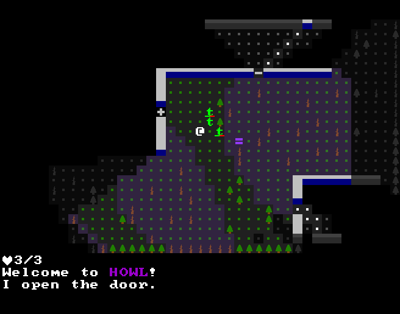

+++
title = "Howl"
date = 2017-01-07T00:00:00+10:00
path = "howl"

[taxonomies]
tags = ["roguelikes"]
+++

Howl is a turn-based tactical game, where everything has an alternate form that
is revealed under moonlight. I started this project to teach myself [the rust
programming language](https://www.rust-lang.org), and to experiment with
[entity component systems](https://wikipedia.org/wiki/Entity-component-system).

The game is still in active development.
Check out the [source code on github](https://github.com/gridbugs/howl).

Note that the linux version of the game depends on sdl2, sdl2\_image, and sdl2\_ttf.

Controls:
- movement: arrow keys
- fire: f, f again to fire, arrow keys move cursor, n/m switch targets
- close door: c followed by arrow key

