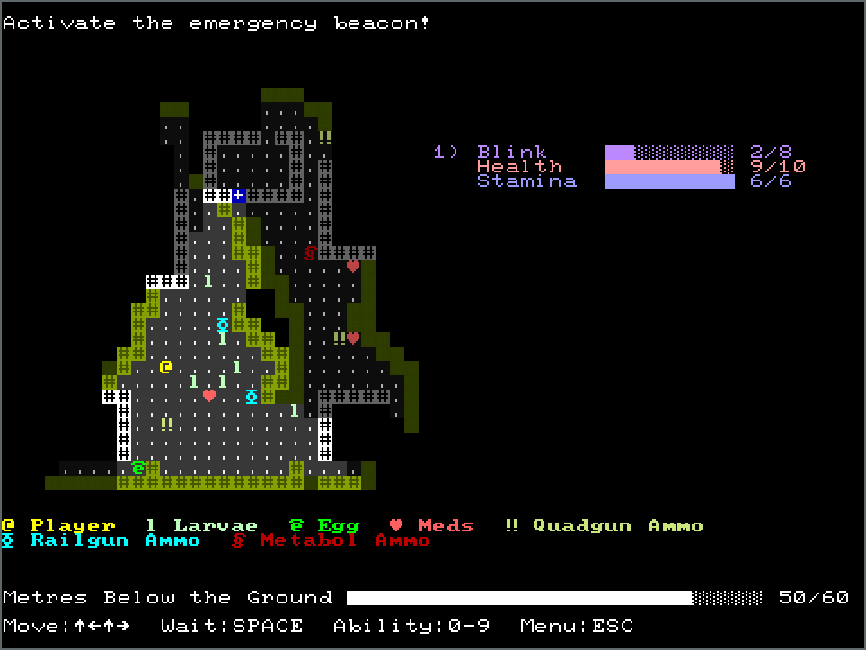

+++
title = "Meters Below the Ground"
date = 2018-03-10T11:30:00+10:00
path = "meters-below-the-ground"

[taxonomies]
tags = ["roguelikes", "7drl"]
+++

Meters Below the Ground is a short tactical dungeon-crawler about escaping from
an insectoid-infested facility. Complete objectives to unlock more meters for
your character so you might stand a chance against the alien threat.

It is my entry in the 7 Day Roguelike game jam for 2018.

Play or download Meters Below the Ground in [its itch.io page](https://gridbugs.itch.io/meters-below-the-ground).

View the [source code on github](https://github.com/gridbugs/meters-below-the-ground).

<!-- more -->

Features:

 - Procedurally generated levels
 - 10 different types of meter
 - Alien insect lifecycles
 - 4 different mission types
 - Runs in a browser, Windows, Linux and macOS
 - Gorgeously-rendered ~~ascii~~ unicode graphics
 - Unix terminal support (linux and macos-non-app only)
