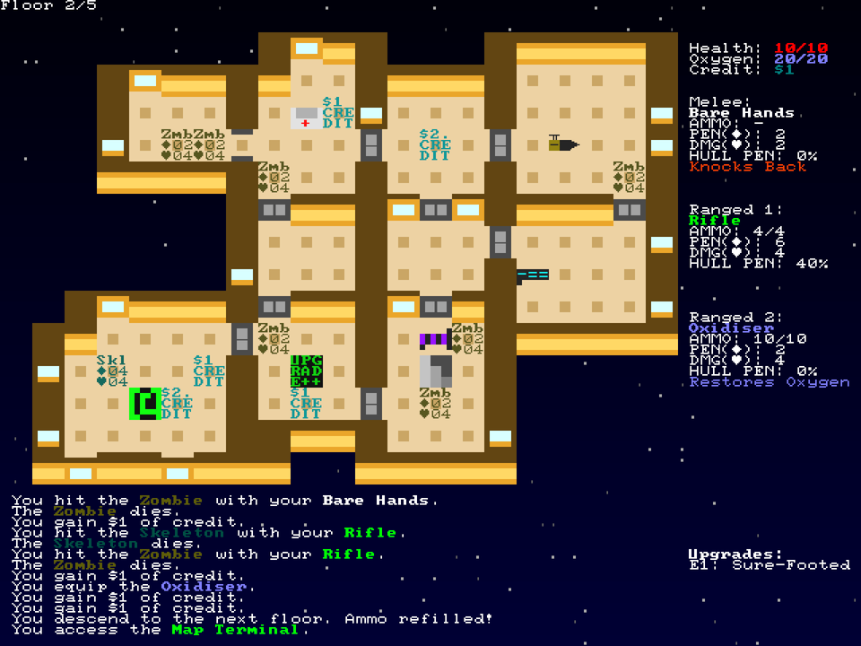
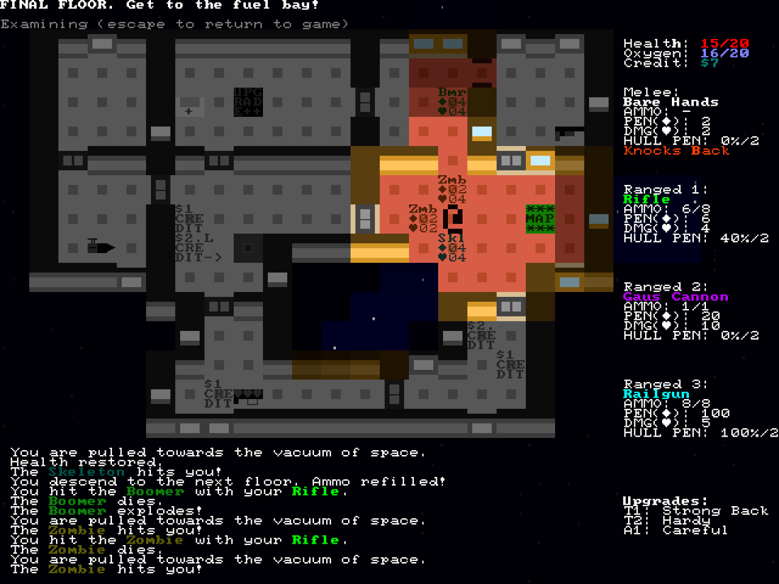
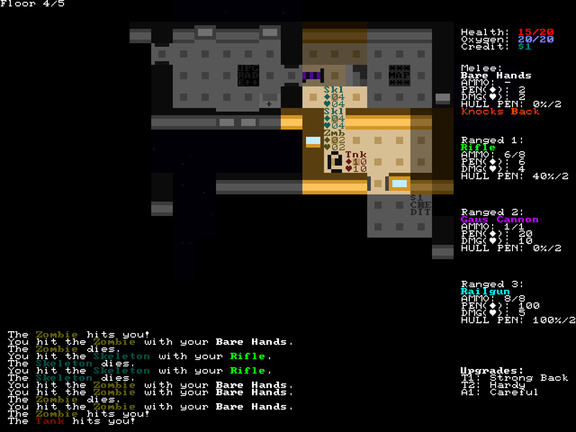
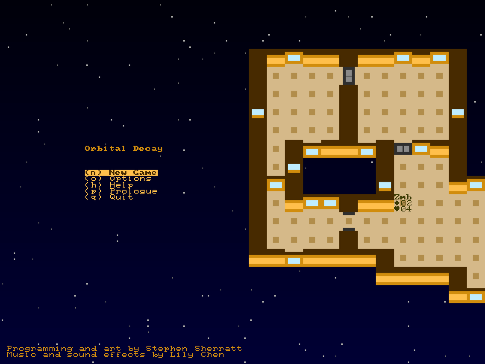

+++
title = "Orbital Decay"
date = 2021-03-14
path = "orbital-decay"

[taxonomies]
tags = ["roguelikes", "7drl"]

[extra]
og_image = "screenshot1.png"
+++

Orbital Decay is a traditional roguelike where you fight zombies on a space station.
It features destructible terrain, an air pressure system, and ranged combat.
Try not to shoot the hull, or you may find yourself sucked out into space!

In keeping with the traditions of the genre, graphics are made entirely of text,
though each tile is made of 3x3 characters.
There is a soundtrack of 6 songs, and about 10 different sound effects.
It's playable in a browser, or a standalone graphical program. MacOS and Linux
users can also play the game in a terminal.

This is my entry in the 7 Day Roguelike 2021 game jam.

**Play or download Orbital Decay on [its itch.io page](https://gridbugs.itch.io/orbital-decay).**

<!-- more -->

This is my 6th 7DRL, and I attempted to take the basic idea of
[my first 7DRL (Skeleton Crew)](@/projects/skeleton-crew/index.md)
and add the strategic and tactical depth that I felt that
game was lacking. I had a blast making this and I think it turned out super
well!

In terms of strategy, the player collects credits which they spend on upgrades. There are 6 upgrades in total,
organized into 2 levels of 3 tracks (Toughness, Accuracy, Endurance). The first level of each track must be
unlocked before the second, and the second level costs more. There isn't enough credit in the game to unlock
all upgrades, so the player is forced to choose what sort of character they will build.

Credit can also be spent unlocking the map on each floor, which provides useful tactical information.

There are 2 ranged weapon slots (or 3 if you take the "Strong Back" upgrade). There are 6 ranged weapons in the
game, and each floor presents you with a random choice of 2. There is also a chainsaw that replaces the "Bare Hands"
melee weapon, but has limited uses and doesn't knock enemies back, so it's not an obvious choice to pick it up.

To motivate tactical decisions, the ranged combat is based around armour penetration (PEN).
Each weapon PENs a certain amount of armour, and each enemy has an armour score.
Bullets keep going until they've gone through the weapon's PEN worth of armour.
This lets you kill multiple enemies with a single shot, which is useful because ammo is scarce
(in fact the only way to get more ammo is to pick up a new gun or descend the stairs to the next level).

Each weapon also has a hull penetration stat (HULL PEN), which is the chance that a bullet will breach the
hull. This makes the PEN stat a double edged sword, as if you can't line up enough enemies to fully absorb
the shot, it will hit the hull which may result in a breach and subsequent decompression.
There are upgrades to reduce the chance that your shots breach the hull, and other upgrades to help
deal with being in vacuum (larger oxygen supply and reduced movement due to the pull of depressurisation).

The game has a dynamic, diminishing lighting system to help develop a spooky atmosphere.
It allows for muzzle flash when firing guns, and awesome glowing projectiles.
There is also a particle system, so bullets leave smoke trails (sometimes even _glowing_ smoke trails!)
and a certain enemy explodes upon death with a satisfying fireball and a cloud of smoke that
dissipates in real time.

Speaking of atmosphere, Orbital Decay features music composed by my extremely talented friend Lily Chen.
There are 6 tracks in total: 1 for the menu, 3 for game levels, and 2 for the multiple pages of epilogue
(your reward for beating the game!).
Lily also made sound effects, so each weapon, doors, explosions, health pickups, and the player's death, are
all accompanied by an audio cue.

Once again the game can be played and downloaded on [itch](https://gridbugs.itch.io/orbital-decay).
Its source code (beware - game jam quality code!) is available on [github](https://github.com/gridbugs/orbital-decay/tree/7drl).
