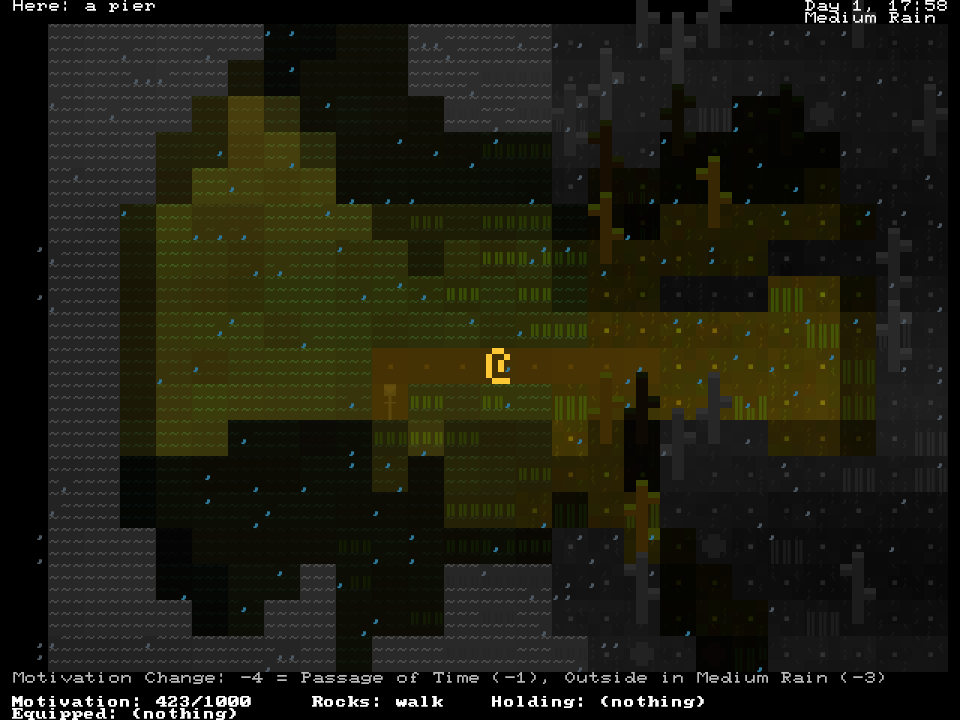

+++
title = "Rain Forest"
date = 2022-04-06
path = "rain-forest"

[taxonomies]
tags = ["roguelikes", "7drl"]

[extra]
og_image = "screenshot.png"
+++

Rain Forest is a roguelike game about spending a few days in a forest, in the
rain. Figure out what daily tasks you can perform to stay motivated to remain
in the forest, and try not to get too wet from the constant rain and rising
flood water. And above all, try to have a relaxing time.

This game is my 7th entry in the [7 Day Roguelike](https://itch.io/jam/7drl-challenge-2022) game jam.

Play or download Rain Forest on [its itch.io page](https://gridbugs.itch.io/rain-forest).

The game is open source, and the code is available on [github](https://github.com/gridbugs/rainforest). It’s written in
rust, and the rendering, IO handling, UI and cross-platform support is handled
by my [chargrid](https://github.com/gridbugs/chargrid) library.

My main focus this year was on setting the mood of a rainy forest. I personally
find rain very calming, and tried to convey this calmness in the aesthetic of
Rain Forest. I’m quite satisfied with how the game turned out visually. I’m
planning to release a new version at some point that includes rain sounds (not
for consideration in the 7DRL of course) to complete the mood.

The gameplay is not particularly exciting; there’s no combat, and most of the
game is wandering around locating the various sites in the forest you can use
to gain motivation, and coming up with a daily routine that evolves as the
flood water rises and the rain gets heavier.

I had some ideas to make it more interactive, like digging ditches to redirect
the water, or stepping stones which can be moved into water to allow the player
to cross safely. These all made it into the game but there’s little incentive
for the player to actually use these features. I couldn’t work out a way to
make it necessary to engage in these mechanics while also being fun. I’m
not sure yet whether I’ll try to come up with gameplay changes to try to
make the game more fun. A part of me wants to strip away the features which
the game doesn’t need and just keep the minimal experience of walking
around in the forest in the rain.
