+++
title = "Scope Creep"
date = 2025-05-09
path = "scope-creep"

[taxonomies]
tags = ["roguelikes", "7drl", "synthesizer", "audio"]

[extra]
og_image = "screenshot1.png"
+++

[Scope Creep](https://gridbugs.itch.io/scope-creep) is a short first-person
horror game rendered with a virtual oscilloscope. In the game the player explores a
dungeon collecting orbs to open a door and escape. Each time an orb is
collected a new class of enemies spawn. All the graphics including text and
enemy sprites is rendered by using a [synthesizer
library](https://github.com/gridbugs/caw) to generating a stereo audio signal
which is then visualized with a virtual XY oscilloscope to produce the game's
graphics. The audio signal also plays out of the speakers so in theory the game
could be rendered on a hardware XY oscilloscope.

It's my 10th (what!) 7DRL game jam entry.
Play it in a web browser on [its itch.io page](https://gridbugs.itch.io/scope-creep).
The source code is [here](https://github.com/gridbugs/scope-creep).
And the devlog I wrote while developing this game begins [here](@/devlogs/7drl2025-day1/index.md).

<iframe width="560" height="315" src="https://www.youtube.com/embed/Uc4z52vJHkA?si=-b49jlildnsSHXGd" title="YouTube video player" frameborder="0" allow="accelerometer; autoplay; clipboard-write; encrypted-media; gyroscope; picture-in-picture; web-share" referrerpolicy="strict-origin-when-cross-origin" allowfullscreen></iframe>

I've been developing a software-defined modular synthesizer library for a
couple of years. Its current incarnation is the [Combinatorial Audio
Workstation (CAW)](https://github.com/gridbugs/caw) - a Rust library for declaratively building synthesizers.
I used it to generate the audio signals used in Scope Creep, as well as for procedurally-generating the
music in real time for a previous project [Electric
Organ](@/projects/electric-organ/index.md).

I came across [Jerobeam Fenderson's oscilloscope
music](https://oscilloscopemusic.com/watch/n-spheres) which inspired me to add
a stereo oscillographics visualizer to CAW ([here's a
demo!](https://gridbugs.github.io/bevy-caw-experiment/)) and then a friend
suggested I use this technique to render a first-person game.

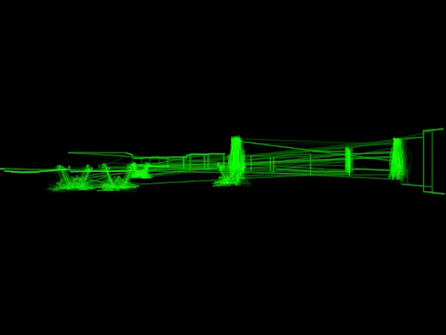

## The Renderer

Rendering with an oscilloscope means we have to get creative with the rendering
algorithm. Most 3D renderers use a pixel-based "raster" algorithm, where each polygon
is converted to a collection of pixels that end up on the screen unless some
other polygon's pixels occlude them. The order in which polygons are drawn
doesn't matter because the renderer keeps track of depth of each visible pixel
and only draws new pixels at the same point on the screen if they represent a
point in space closer to the eye than what's currently drawn there. This is
called "depth buffering".

Depth buffering wasn't an option for this project because the only thing the
render can draw is lines - not pixels. Only the outline of each wall is drawn.
The black pixels making up the floor, ceiling, and wall surfaces are drawn once
at the start of each frame when the screen is cleared, and not updated again.
This means that we can't draw black surfaces to occlude whatever would be
behind them. Instead we need to avoid drawing anything that would be occluded
in the first place.

So how do we figure out which parts of which walls are visible? I'll give a
rough sketch of the approach taken by Scope Creep. It won't be a complete
explanation of the renderer - just the key idea it's based on. For more
details,
[here](https://github.com/gridbugs/scope-creep/blob/b5f6bafacb52e9ecbc1332ffbcde1a60873e55e4/src/main.rs#L1412)'s
a link to where this algorithm is implemented (but beware that this code is
from a game jam!).

Here's a typical 3D scene. All the walls are the same height, and the floor and
ceiling are completely flat. It happens that all corners are right-angles but
this is not necessary for this rendering technique to work (just a limitation
of the terrain generation algorithm I'm using here).

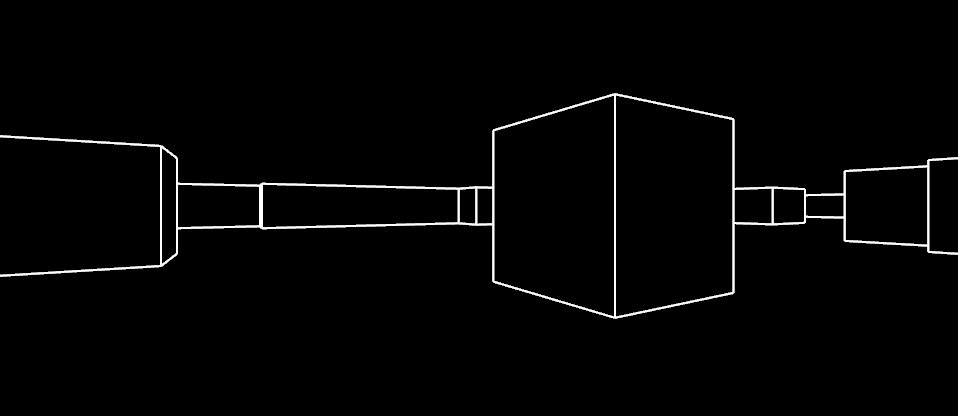

A couple of observations about this scene:
 - The scene is symmetrical along the horizontal axis. For simplicity, I'll therefore only talk about the top half of the scene from now on.
 - The scene is made up entirely of a collection of vertical lines, with each adjacent pair of vertical lines being connected by a "connecting" line.
 - Sometimes these connecting lines attach to the very top of a vertical line, and other times they connect somewhere in the middle.

So to render a scene all we have to do is identify the vertical lines that make
it up, and for each vertical line, determine the height of the connecting line
attached to its left and right side.

There are three cases for how connecting lines attach to a vertical line. Either both connecting lines attach to the top:

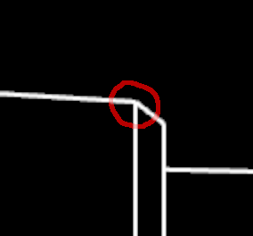

...or the connecting line on the left side attaches to the top but the connecting line on the right side does not:

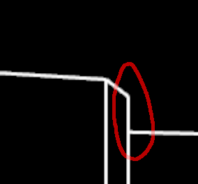

And for completeness, here's one that's only connected at the top on its right side:

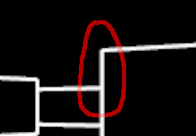

Now let's consider the scene from above.
Here's the rendered scene again for convenience:

...and here's a bird's eye view, with the open space in black and the walls in
bright yellow (the inaccessible parts of the map are shaded dark yellow). Each
corner visible in the 3D scene has been circled. The eye is the red circle at
the bottom of the map, and is facing upwards.

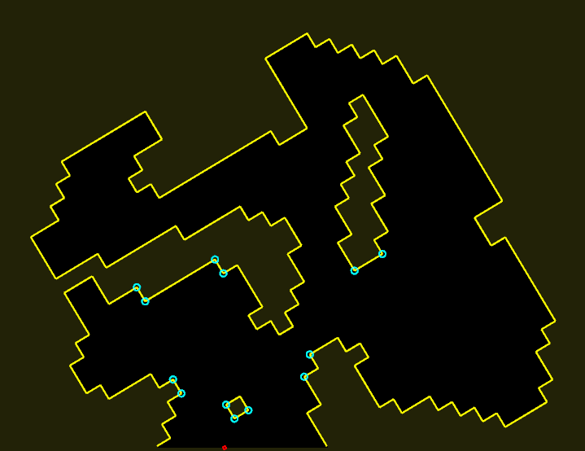

Manually highlighting the visible area gives a hint as to how to determine the
connectedness of vertical lines.

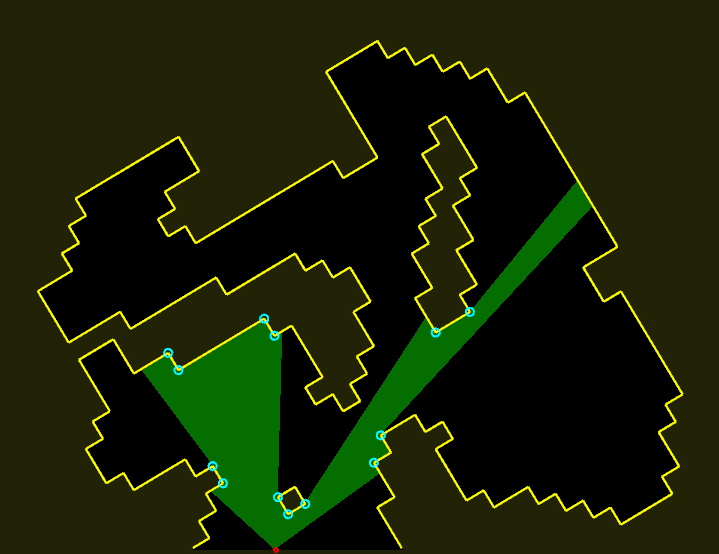

The 3D scene again:

Sometimes when a corner between two walls is visible, both of the walls the
corner is between are visible too. Imagine shooting a ray of light from the eye
to the corner. If both sides of the corner are visible, the ray hits a solid
surface and stops.

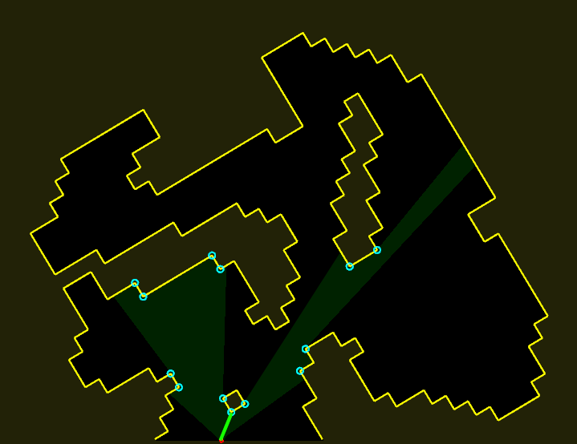

This corresponds to a vertical line with both its connecting lines connecting directly to its top.
The height of the vertical line is inversely proportional to how far the ray
travelled before it stopped (ie. the distance from the eye to the corner).

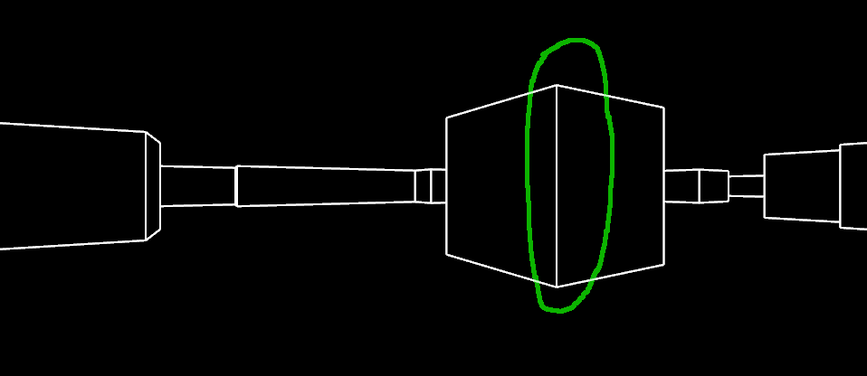

But if only one wall attached to the corner is visible, the ray continues until
it hits a wall somewhere behind the corner.

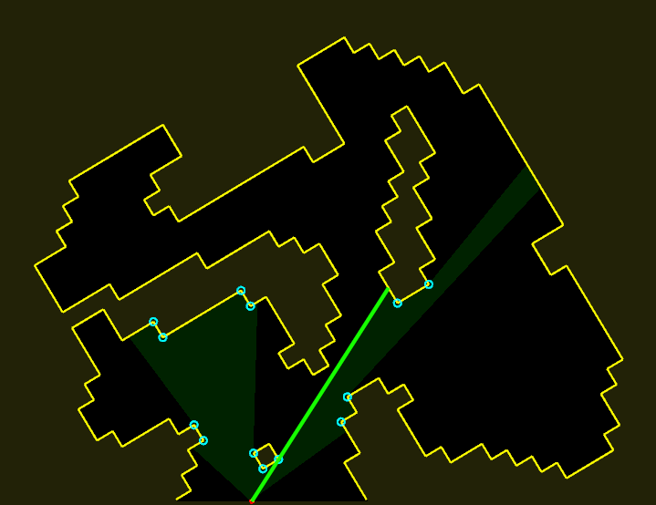

And this corresponds to a vertical line with only one of its connecting lines
connected to the top, and the other connected part way down.
The point on the vertical line where the second connecting line connects is at
a distance from the centre of the vertical line inversely proportional to the
distance the ray travelled before it stopped.

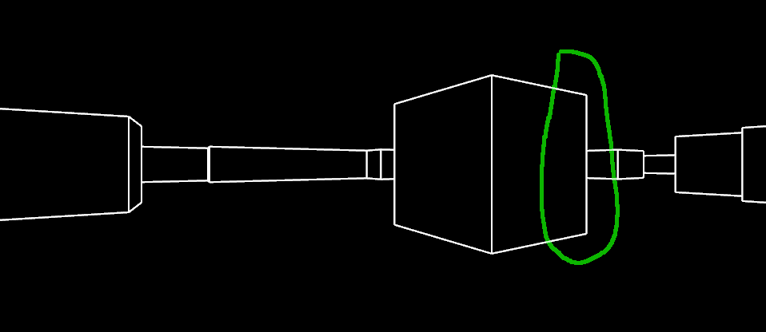

In addition to the level geometry Scope Creep also has items and enemies.
These need to be rendered in such a way that they are
occluded by walls. This is achieved by creating a new wall segment for each
enemy/object, determining how much of that wall would be visible, and then
restricting the visible area while rendering the enemy/object to that range.

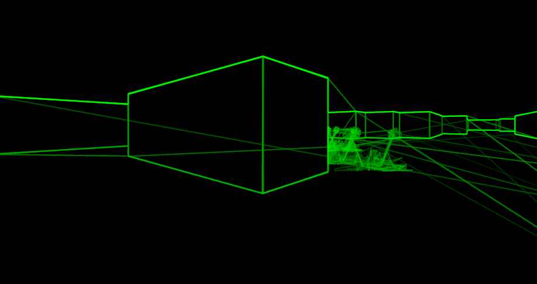

That's the rough idea behind rendering in Scope Creep. Once all the vertical
and connecting lines have been computed, the sequence of movements in the X and
Y axis required to draw them as if with an etch-a-sketch is determined, and
this determines audio signal in the left and right channel respectively.
