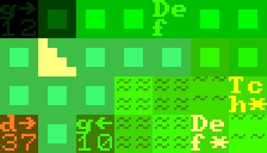
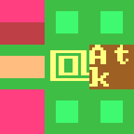
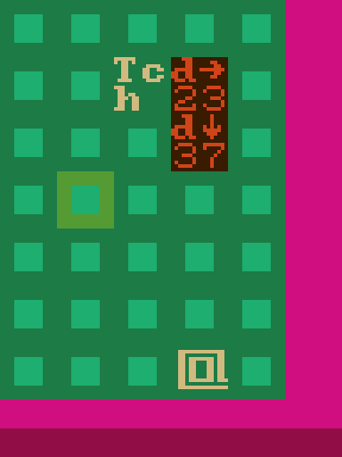

+++
title = "slime99"
date = 2020-03-08T06:00:00+10:00
path = "slime99"

[taxonomies]
tags = ["roguelikes", "7drl"]

[extra]
og_image = "screenshot.png"
+++

A traditional roguelike where the outcomes of attacking and defending are pre-determined and visible.
Gameplay revolves around fighting slimes, adding to your sequence of combat outcomes, and using
abilities to modify the order in which combat outcomes occur. It's set in a neon sewer!

It's my entry in the 2020 7 Day Roguelike game jam.

Play or download slime99 on [its itch.io page](https://gridbugs.itch.io/slime99).

View the [source code on github](https://github.com/gridbugs/slime99).


<!-- more -->

## Reflection

### 2x2 Cells

The player is shown a sequence of attack damage values. Their next attack will remove the next damage value
from the sequence, and deal that much damage to the enemy they chose to attack. Therefore the main tactical
decision for the player, at least when it comes to attacking, is choosing which enemy to deal damage to.
In order for this decision to be meaningful, the player needs to know how much health each enemy has left.

I limit myself to text-only graphics. The game is rendered as a grid of cells, each containing a unicode
character, and a foreground and background colour. Text-only "graphics" in roguelikes is a
[tradition as old as the genre itself](https://en.wikipedia.org/wiki/Rogue_(video_game)), but typically
each cell of the game world is represented by a single character. To convey enemy health, I needed more
than one character per game cell.



Game cells are rendered as 2x2 squares of unicode characters. A 2-digit number representing enemy
health can easily be drawn as part of the enemy's tile. An unintended benefit of 2x2 squares is that
the stairs can look like real stairs with some creative use of block characters.

A complication introduced by 2x2 squares is if you *want* a single character in a game cell - you can't just
draw it twice as big to fill the cell. I wanted to represent the player character as an '@' sign (as is customary)
so I had to improvise an '@'-looking arrangement of unicode box-drawing characters.



Each enemy is drawn as 4 characters: a letter indicating what type of enemy they are, 2-digits for their health.
But what to do with the 4th character?

### Enemies telegraph their next actions

The top-right character of each enemy's 2x2 character cell is used to show the player which direction that
enemy will move on their next turn. I did this [last year](@/projects/get-well-soon/index.md) too, but since each
enemy was rendered with a single character, I had to draw the arrow on the ground.


Enemies pre-committing to, and declaring their movement drastically changes the feel of the game.
Since more information is known about the next turn, each decision about where and when to move
is more informed, and feels more meaningful. This can make combat feel more like a puzzle than
in a typical roguelike where enemy actions aren't known. I think it works for this game, which already
has a fairly puzzle-like vibe due to the public sequence of attack/defense outcomes,
but it's definitely something that should be added to a game deliberately.

It also has implications for AI. The AI runs to decide where each enemy will move. The result of this isn't
applied right away (as it would be if enemies didn't pre-commit to their actions), but instead is used to
indicate to the player where enemies will move on their *next* turn.



Also on the subject of AI, I want to do some work on my AI system to remove the above situation.
In this example, both enemies want to get closer to the player, but the one on top is moving to the right,
which takes it further away. It does this because at the point when it decided where to move, there was
an enemy below it. The top enemy didn't account for the fact that when it's turn came to move, the
bottom enemy would have gotten out of the way. If enemies didn't try to avoid walking into each other,
this problem would go away, but be replaced by the problem of enemies with conflicting goals colliding
and getting stuck on each other.

Clearly more experimentation is needed!

### Not Working

I was between jobs during this year's 7DRL. I initially intended to spend all my time working on my game,
but this proved unrealistic. I found that I got diminishing returns on time spent working on the game
after maybe 6 hours of work. I took regular, lengthy breaks, and slept a lot (for a 7DRL, which I guess is
just the usual amount!). I think scope-wise slime99 is similar to my previous 7DRLs, though at the end
of the week I feel a lot more positive than I usually do after the 7DRL.

### Wave Function Collapse

Like last year, levels are generated using [the Wave Function Collapse algorithm](@/blog/wave-function-collapse/index.md).
The main difference in my use of WFC this year is I only use it to place walls.
Sludge pools, doors and bridges are
placed by hand-crafted post-processing steps that run on the direct output of WFC.
I had no post-processing last year, and as a result features like doors and bridges over sludge pools
weren't possible (high level rules like "the level must be connected") can't be satisfied by WFC.
To compensate for the lack of these features, last year I tried to make the level layout itself interesting,
by crafting complex input patterns for WFC. This caused level generation to take a (sometimes painfully) long time.
This year the input is simpler, and level generation is effectively instant.

### Escape from State Machine Hell

[Last year](@/devlogs/7drl2019-day4/index.md) I lamented that as the number of menus and other interactive UI
elements grew, the complexity of knowing what to render, and what to do with inputs, grew to the point
of unmaintainability. In response to this, I made a library for implementing reusable, composable, "pseudo-synchronous"
state machines.

My game is tick-based. Every time a key is pressed, the mouse is moved, or a new frame is rendered,
a function is called which updates the state of the application, and tells the renderer what to render.
At any point, the application could be displaying a menu, displaying the game, displaying a UI for aiming,
displaying some text (e.g. story screen, controls list). In each of these states, input needs to be interpreted
differently, and different stuff needs to be rendered. In the past I had a giant state machine, and explicitly coded
state transitions. The renderer would look at the current state to know what to draw, and the input system
would look at the current state to know how to interpret input.
[This rapidly got out of hand as more states were added.](https://github.com/gridbugs/gws/blob/38d0181ec536023ae584feb9bb81a89fd34fcdb4/prototty/src/lib.rs#L531)

This year I did something different. I made a library defining an interface I call an "EventRoutine".
An event routine is a state machine which can be rendered, respond to inputs and timer events, and
eventually stop, possibly returning a value. A library of combinators make it possible to write code that
"looks synchronous", even though it's actually tick-based. Imagine being able to call a function which displays
a menu, and returns whatever was selected by the user. This library makes it almost look like you're calling
a function that does just this, but actually produces a tick-based state machine.

Here's some code from the game, which displays the "choose an ability" menu.
```rust
 Ei::A(game())
    .repeat(|game_return| match game_return {
        GameReturn::LevelChange(ability_choice) => {
            Handled::Continue(Ei::C(level_change_menu(ability_choice)
                    .and_then(|choice| {
                make_either!(Ei = A | B);
                match choice {
                    Err(menu::Escape) => Ei::A(Value::new(GameReturn::Pause)),
                    Ok(ability) =>
                        Ei::B(game_injecting_inputs(vec![
                            InjectedInput::LevelChange(ability),
                        ])),
                }
            })))
        }
        // handle other GameReturn values here
```

The behaviour of this code is roughly:

Run the game until it stops for some reason.
When it stops, if it stops because the level changed (`GameReturn::LevelChange`) run the `level_change_menu` event routine,
which takes a list of abilities, displays a menu, and "returns" when a choice is made.
If the choice was to cancel the menu (`Err(menu::Escape)`), pause the game (displays the main menu).
Otherwise, if an ability was chosen, run the `game_injecting_inputs` event routine, which runs
the game starting with a specified input event. Specify the input event which gives the player the chosen ability.

This is much more ergonomic than an explicit state machine!

### Playtesting

I spent a long time on the last day just playing the game and tweaking things which I thought were too hard, too easy,
or too confusing. I cut several types of enemy and combat outcome which lead to confusing interactions.
I even roped my partner into playing the game a few times to see whether the game was too easy/hard for someone who
hadn't spent the past 7 days making it. I think the end result is fun to play. Right before submitting I needed some
more screenshots and did a playthrough to get them, but forgot to record any (though it was like 3am).

### Synergy

Here's an interaction I'm very happy with:

Each enemy has a chance to drop an item when they die. There's one kind of enemy called a "divide slime" which splits
into two when damaged. If you push this enemy into a sludge pool, over the course of several turns it splits several times
into many slimes, which eventually die from the sludge. And drop items, so this would be an easy way to farm items...except
all the items are now in a sludge pool, so you have to decide whether it's worth the damage you will receive
picking them up.

### What to improve next

Music is broken on non-web versions of my engine. The game crashes after a few minutes of music playing.
This seems to be a problem with a low-level audio library I'm using. Further testing is needed.

Animation still needs work. It's easy to add realtime animations to entities, such as making sludge flicker between colours,
or making enemies slide away from you when you use "Repel". What's still messy is adding delays after the enemy acts
so you can see intermediate states, such as a divide slime splitting when taking damage from sludge.
