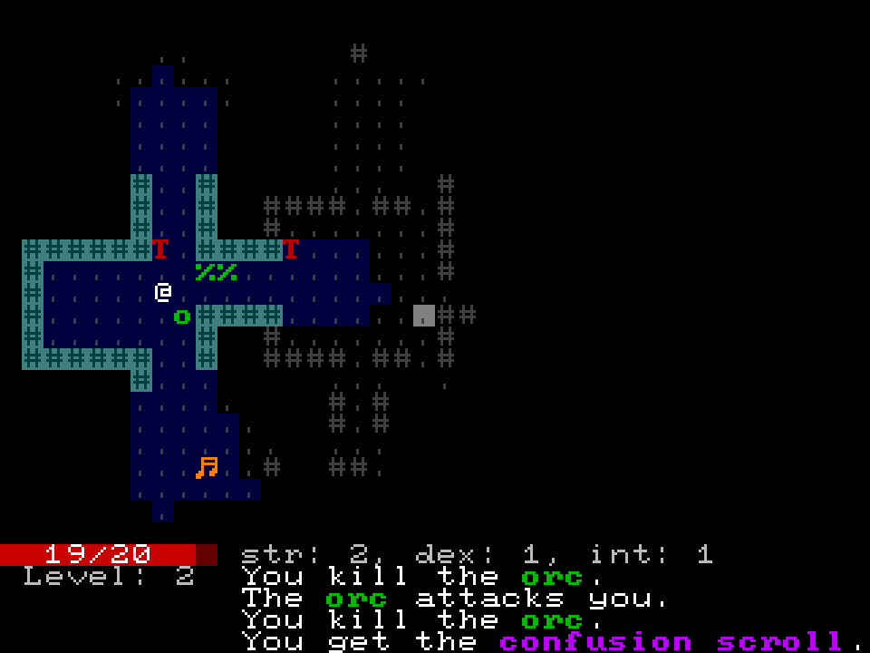

+++
title = "Part 12 - Increasing Difficulty"
date = 2020-08-15T19:30:00+10:00
path = "roguelike-tutorial-2020-part-12"

[extra]
og_image = "screenshot-end.png"
+++

In this part we'll update terrain generation logic such that the game gets
more difficult the deeper you descend into the dungeon.



This part is loosely based on [this part](http://rogueliketutorials.com/tutorials/tcod/part-12/) of the
python tcod tutorial.

Reference implementation branch for starting point: [part-11-end](https://github.com/gridbugs/chargrid-roguelike-tutorial-2020/tree/part-11-end)

We'll start by replacing the logic for choosing which NPC and item to spawn with a generic probability distribution.
This will make it easier to increase the chance of spawning more dangerous NPCs and more powerful items, the deeper
the player descends. It will also make it easier to balance the game later, as the logic for placing NPCs and items
will be separate from the specification of how likely each NPC and item is to spawn.

Add this function to `terrain.rs`. It takes a probability distribution represented by a slice of pairs of values and numbers,
where the relative size of numbers determines the chance that a value is chosen.
```rust
// terrain.rs
...
fn choose_from_probability_distribution<'a, T, R: Rng>(
    probability_distribution: &'a [(T, u32)],
    rng: &mut R,
) -> &'a T {
    let sum = probability_distribution.iter().map(|(_, p)| p).sum::<u32>();
    let mut choice = rng.gen_range(0..sum);
    for (value, probability) in probability_distribution.iter() {
        if let Some(remaining_choice) = choice.checked_sub(*probability) {
            choice = remaining_choice;
        } else {
            return value;
        }
    }
    unreachable!()
}
...
```

Add functions which generate probability distributions for NPCs and items.
```rust
// terrain.rs
...
fn make_npc_probability_distribution(level: u32) -> Vec<(NpcType, u32)> {
    use NpcType::*;
    vec![(Orc, 20), (Troll, level)]
}

fn make_item_probability_distribution(level: u32) -> Vec<(ItemType, u32)> {
    use ItemType::*;
    vec![
        (HealthPotion, 20),
        (
            FireballScroll,
            match level {
                0..=1 => 1,
                2..=4 => 5,
                _ => 10,
            },
        ),
        (
            ConfusionScroll,
            match level {
                0..=1 => 1,
                2..=4 => 3,
                _ => 5,
            },
        ),
    ]
}
...
```

During play-testing, these are values that can be tweaked to adjust the difficulty of the game.

Update `Room::place_npcs` and `Room::place_items` to use generic probability distributions.

```rust
// terrain.rs
...
impl Room {
    ...
    // Place `n` randomly chosen NPCs at random positions within the room
    fn place_npcs<R: Rng>(
        &self,
        n: usize,
        probability_distribution: &[(NpcType, u32)],
        grid: &mut Grid<Option<TerrainTile>>,
        rng: &mut R,
    ) {
        for coord in self
            .coords()
            .filter(|&coord| grid.get_checked(coord).unwrap() == TerrainTile::Floor)
            .choose_multiple(rng, n)
        {
            let &npc_type = choose_from_probability_distribution(probability_distribution, rng);
            *grid.get_checked_mut(coord) = Some(TerrainTile::Npc(npc_type));
        }
    }

    // Place `n` items at random positions within the room
    fn place_items<R: Rng>(
        &self,
        n: usize,
        probability_distribution: &[(ItemType, u32)],
        grid: &mut Grid<Option<TerrainTile>>,
        rng: &mut R,
    ) {
        for coord in self
            .coords()
            .filter(|&coord| grid.get_checked(coord).unwrap() == TerrainTile::Floor)
            .choose_multiple(rng, n)
        {
            let &item = choose_from_probability_distribution(probability_distribution, rng);
            *grid.get_checked_mut(coord) = Some(TerrainTile::Item(item));
        }
    }
}
...
```
Update `generate_dungeon` to create probability distributions.

```rust
// terrain.rs
...
pub fn generate_dungeon<R: Rng>(size: Size, level: u32, rng: &mut R) -> Grid<TerrainTile> {
    ...
    let npc_probability_distribution = make_npc_probability_distribution(level);
    let item_probability_distribution = make_item_probability_distribution(level);

    // Attempt to add a room a constant number of times
    const NUM_ATTEMPTS: usize = 100;
    for _ in 0..NUM_ATTEMPTS {
        ...
        if room.only_intersects_empty(&grid) {
            ...

            // Add npcs to the room
            let &num_npcs = NPCS_PER_ROOM_DISTRIBUTION.choose(rng).unwrap();
            room.place_npcs(num_npcs, &npc_probability_distribution, &mut grid, rng);

            // Add items to the room
            let &num_items = ITEMS_PER_ROOM_DISTRIBUTION.choose(rng).unwrap();
            room.place_items(num_items, &item_probability_distribution, &mut grid, rng);
        }
    }
    ...
}
```

Update `world.rs` to pass a level to `generate_dungeon`.

```rust
...
impl World {
    ...
    pub fn populate<R: Rng>(&mut self, level: u32, rng: &mut R) -> Populate {
        let terrain = terrain::generate_dungeon(self.spatial_table.grid_size(), level, rng);
        ...
    }
    ...
}
```

And update `game.rs` to pass the current level to `World::populate`.

```rust
...
impl GameState {
    pub fn new(
        screen_size: Size,
        rng_seed: u64,
        initial_visibility_algorithm: VisibilityAlgorithm,
    ) -> Self {
        ...
        let dungeon_level = 1;
        let Populate {
            player_entity,
            ai_state,
        } = world.populate(dungeon_level, &mut rng);
        ...
    }

    pub fn player_level_up_and_descend(&mut self, level_up: LevelUp) {
        ...
        self.dungeon_level += 1;
        let Populate {
            player_entity,
            ai_state,
        } = self.world.populate(self.dungeon_level, &mut self.rng);
        ...
    }
    ...
}
```

Now play the game a bunch and tweak the probabilities of NPCs and items until it's fun.
There's one more part after this one, in which we'll add equipment.

Reference implementation branch: [part-12.0](https://github.com/gridbugs/chargrid-roguelike-tutorial-2020/tree/part-12.0)

[Click here for the next part!](@/roguelike-tutorial-2020/part13/index.md)
