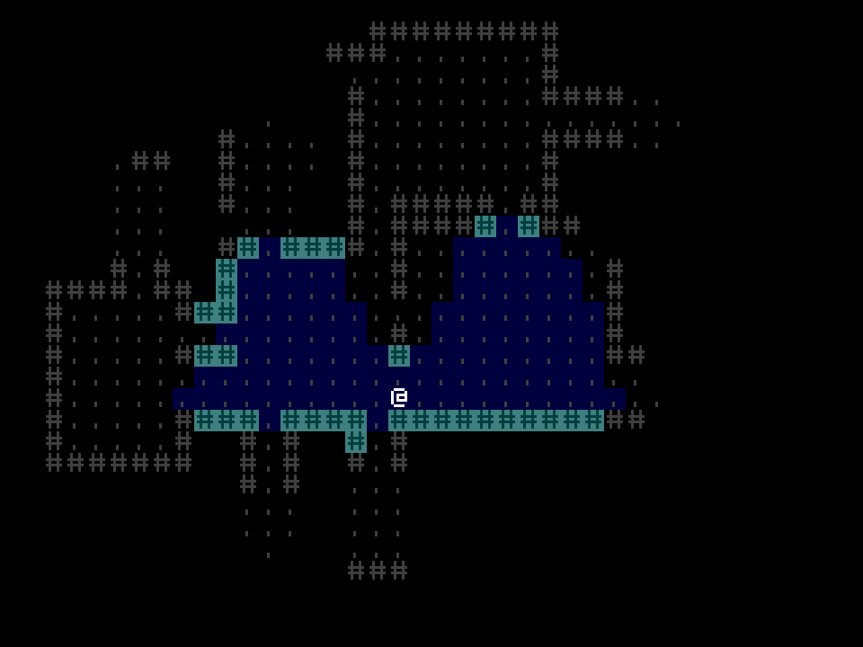

+++
title = "Part 4 - Field of View"
date = 2020-07-02T22:00:00+10:00
path = "roguelike-tutorial-2020-part-4"

[extra]
og_image = "screenshot-end.png"
+++

In this part we'll implement visible area detection, so players can only see what their
character can see, and what they remember seeing.

By the end of this part, the game will look like this:


<!-- more -->

This part is loosely based on [this part](http://rogueliketutorials.com/tutorials/tcod/part-4/) of the
python tcod tutorial.

Reference implementation branch for starting point: [part-3-end](https://github.com/gridbugs/chargrid-roguelike-tutorial-2020/tree/part-3-end)

In this post:
- [Separate World Representation from Game State](#separate-world-representation-from-game-state)
- [Add Field of View](#add-field-of-view)

## Separate World Representation from Game State

Before adding field-of-view, let's move some fields of `GameState` into a new struct called `World`.
Splitting large structs into a deeper hierarchy of small structs with specific purposes is good practice
in general, and in rust in particular it can help keep the borrow-checker off our backs.

In a new file `src/world.rs`, define a type `World`:

```rust
// world.rs
...
pub struct World {
    pub entity_allocator: EntityAllocator,
    pub components: Components,
    pub spatial_table: SpatialTable,
}
```

Move all the types and methods relating to world representation from `src/game.rs` into `src/world.rs`.
When you're done, `GameState` should be a thin wrapper around the new `World` type (we'll add more to it shortly).
All that's left of `src/game.rs` will be:

```rust
// game.rs
use crate::world::{Location, Populate, Tile, World};
use coord_2d::Size;
use direction::CardinalDirection;
use entity_table::Entity;
use rand::SeedableRng;
use rand_isaac::Isaac64Rng;

pub struct EntityToRender {
    pub tile: Tile,
    pub location: Location,
}

pub struct GameState {
    world: World,
    player_entity: Entity,
}

impl GameState {
    pub fn new(screen_size: Size) -> Self {
        let mut world = World::new(screen_size);
        let mut rng = Isaac64Rng::from_entropy();
        let Populate { player_entity } = world.populate(&mut rng);
        Self { world, player_entity }
    }
    pub fn maybe_move_player(&mut self, direction: CardinalDirection) {
        self.world.maybe_move_character(self.player_entity, direction);
    }
    pub fn entities_to_render<'a>(&'a self) -> impl 'a + Iterator<Item = EntityToRender> {
        let tile_component = &self.world.components.tile;
        let spatial_table = &self.world.spatial_table;
        tile_component.iter().filter_map(move |(entity, &tile)| {
            let &location = spatial_table.location_of(entity)?;
            Some(EntityToRender { tile, location })
        })
    }
}
```

Here's how the code should look after this refactor: [part-4.0](https://github.com/gridbugs/chargrid-roguelike-tutorial-2020/tree/part-4.0)

In particular, note the new file [src/world.rs](https://github.com/gridbugs/chargrid-roguelike-tutorial-2020/blob/part-4.0/src/world.rs).

## Add Field of View

Now for the interesting part. We'll be adding visible-area-detection using an implementation of the "Recursive Shadowcast" algorithm.
For a detailed description of this algorithm, see [this post on gridbugs](@/blog/visible-area-detection-recursive-shadowcast/index.md)
or [this one on roguebasin](http://www.roguebasin.com/index.php?title=FOV_using_recursive_shadowcasting).
Grab a crate which contains an implementation of the field-of-view algorithm:

```toml
# Cargo.toml
...
[dependencies]
shadowcast = "0.8"
```

The `shadowcast` crate doesn't assume anything about how the world is represented.
In order to compute the visible area,
it needs to know some things about the world. In particular, this trait must be implemented:

```rust
pub trait InputGrid {

    // type containing the world state
    type Grid;

    // type representing the opacity at a point of the world
    type Opacity;

    // the dimensions of the world
    fn size(&self, grid: &Self::Grid) -> Size;

    // query the opacity of the world at a particular coordinate
    fn get_opacity(&self, grid: &Self::Grid, coord: Coord) -> Self::Opacity;
}
```

Let's implement this trait for our game! Make a new file `src/visibility.rs`:

```rust
// visibility.rs
use crate::world::World;
use coord_2d::{Coord, Size};

struct Visibility;

impl shadowcast::InputGrid for Visibility {
    type Grid = World;
    type Opacity = u8;
    fn size(&self, world: &Self::Grid) -> Size {
        world.size()
    }
    fn get_opacity(&self, world: &Self::Grid, coord: Coord) -> Self::Opacity {
        world.opacity_at(coord)
    }
}
```

The `Visibility` type has no state, and serves only as a named implementation of the `InputGrid` trait.
Note that the `size` and `opacity_at` methods of `World` don't exist yet. Let's write them now.

```rust
// world.rs
...
impl World {
    ...
    pub fn size(&self) -> Size {
        self.spatial_table.grid_size()
    }
    pub fn opacity_at(&self, coord: Coord) -> u8 {
        if self
            .spatial_table
            .layers_at_checked(coord)
            .feature
            .is_some()
        {
            255
        } else {
            0
        }
    }
}
```

For now, if a cell contains a feature it is fully opaque, and otherwise it is fully transparent.

Now we need a way to represent what the player can currently see, and what they have seen in the past.
Represent this with a grid of cells. Every so often (perhaps once per turn), we'll iterate over all the
cells that the player can currently see, and mark the cells in this grid as "currently visible".
To avoid needing to visit all the other cells, and mark them as "not currently visible", we'll employ
the following technique:

Keep a counter which is incremented each time the visible area is updated.
Each cell of the grid will store the value that the counter had the last time
that cell was visible. A cell is currently visible if its value is the same as the
current counter value. A cell was previously visible if its value is above 0 (as the counter is initialized to 1).

```rust
// visibility.rs
use grid_2d::Grid;
...
pub struct VisibilityGrid {
    grid: Grid<VisibilityCell>,
    count: u64,
}

impl VisibilityGrid {
    pub fn new(size: Size) -> Self {
        Self {
            grid: Grid::new_default(size),
            count: 1,
        }
    }
    pub fn cell_visibility(&self, coord: Coord) -> CellVisibility {
        if let Some(cell) = self.grid.get(coord) {
            if cell.last_seen == self.count {
                CellVisibility::Currently
            } else if cell.last_seen == 0 {
                CellVisibility::Never
            } else {
                CellVisibility::Previously
            }
        } else {
            CellVisibility::Never
        }
    }
}
struct VisibilityCell {
    last_seen: u64,
}

impl Default for VisibilityCell {
    fn default() -> Self {
        Self { last_seen: 0 }
    }
}

pub enum CellVisibility {
    Currently,
    Previously,
    Never,
}
```

Now we need a way to update this grid by visiting all visible cells:

```rust
// visibility.rs
...

const VISION_DISTANCE_SQUARED: u32 = 100;
const VISION_DISTANCE: shadowcast::vision_distance::Circle =
    shadowcast::vision_distance::Circle::new_squared(VISION_DISTANCE_SQUARED);

...

impl VisibilityGrid {
    ...
    pub fn update(
        &mut self,
        player_coord: Coord,
        world: &World,
        shadowcast_context: &mut shadowcast::Context<u8>,
    ) {
        self.count += 1;
        let count = self.count;
        let grid = &mut self.grid;
        shadowcast_context.for_each_visible(
            player_coord,       // centre of vision
            &Visibility,        // implementation of InputGrid
            world,              // world representation (InputGrid::World)
            VISION_DISTANCE,    // shape and size of visible area
            255,                // max opacity value (InputGrid::Opacity)
            |coord, _visible_directions, _visibility| {
                let cell = grid.get_checked_mut(coord);
                cell.last_seen = count;
            },
        );
    }
}
```

Computing visible area involves populating some heap-allocated data structures
(see the [implementation of shadowcast](https://github.com/gridbugs/shadowcast/blob/master/src/shadowcast.rs)
for details).
To prevent needing to allocate and free these structures each time the visible area is updated,
all these data structures are contained in a `shadowcast::Context`, allowing the memory to be re-used
each time. Its type parameter corresponds to `InputGrid::Opacity`.

Add a `VisibilityGrid` and `shadowcast::Context<u8>` to `GameState`, and add a method to 'GameState'
for updating the visible area.

```rust
// game.rs
use crate::visibility::{CellVisibility, VisibilityGrid};
...
pub struct GameState {
    world: World,
    player_entity: Entity,
    shadowcast_context: shadowcast::Context<u8>,
    visibility_grid: VisibilityGrid,
}

impl GameState {
    pub fn new(screen_size: Size) -> Self {
        let mut world = World::new(screen_size);
        let mut rng = Isaac64Rng::from_entropy();
        let Populate { player_entity } = world.populate(&mut rng);
        let shadowcast_context = shadowcast::Context::default();
        let visibility_grid = VisibilityGrid::new(screen_size);
        let mut game_state = Self {
            world,
            player_entity,
            shadowcast_context,
            visibility_grid,
        };
        game_state.update_visibility();
        game_state
    }
    pub fn update_visibility(&mut self) {
        let player_coord = self.world.spatial_table.coord_of(self.player_entity).unwrap();
        self.visibility_grid
            .update(player_coord, &self.world, &mut self.shadowcast_context);
    }
    ...
}
```

Note the call to `game_state.update_visibility()` within `GameState::new`. This is so when the game starts,
the initially-visible area is marked as visible.

In order to tell the rendering logic whether a cell is currently, previously, or never visible, update
`EntityToRender` to contain a `CellVisibility`, and update `entities_to_render` to set the new field:

```rust
pub struct EntityToRender {
    pub tile: Tile,
    pub location: Location,
    pub visibility: CellVisibility,
}

impl GameState {
    ...
    pub fn entities_to_render<'a>(&'a self) -> impl 'a + Iterator<Item = EntityToRender> {
        let tile_component = &self.world.components.tile;
        let spatial_table = &self.world.spatial_table;
        let visibility_grid = &self.visibility_grid;
        tile_component.iter().filter_map(move |(entity, &tile)| {
            let &location = spatial_table.location_of(entity)?;
            let visibility = visibility_grid.cell_visibility(location.coord);
            Some(EntityToRender {
                tile,
                location,
                visibility,
            })
        })
    }
}
```

Update the rendering logic to draw cells differently depending on their visibility.

```rust
// app.rs
use crate::visibility::CellVisibility;
...
fn currently_visible_view_cell_of_tile(tile: Tile) -> ViewCell {
    match tile {
        Tile::Player => ViewCell::new()
            .with_character('@')
            .with_foreground(Rgb24::new_grey(255)),
        Tile::Floor => ViewCell::new()
            .with_character('.')
            .with_foreground(Rgb24::new_grey(63))
            .with_background(Rgb24::new(0, 0, 63)),
        Tile::Wall => ViewCell::new()
            .with_character('#')
            .with_foreground(Rgb24::new(0, 63, 63))
            .with_background(Rgb24::new(63, 127, 127)),
    }
}

fn previously_visible_view_cell_of_tile(tile: Tile) -> ViewCell {
    match tile {
        Tile::Player => ViewCell::new()
            .with_character('@')
            .with_foreground(Rgb24::new_grey(255)),
        Tile::Floor => ViewCell::new()
            .with_character('.')
            .with_foreground(Rgb24::new_grey(63))
            .with_background(Rgb24::new_grey(0)),
        Tile::Wall => ViewCell::new()
            .with_character('#')
            .with_foreground(Rgb24::new_grey(63))
            .with_background(Rgb24::new_grey(0)),
    }
}

impl<'a> View<&'a AppData> for AppView {
    fn view<F: Frame, C: ColModify>(
        &mut self,
        data: &'a AppData,
        context: ViewContext<C>,
        frame: &mut F,
    ) {
        for entity_to_render in data.game_state.entities_to_render() {
            let view_cell = match entity_to_render.visibility {
                CellVisibility::Currently => {
                    currently_visible_view_cell_of_tile(entity_to_render.tile)
                }
                CellVisibility::Previously => {
                    previously_visible_view_cell_of_tile(entity_to_render.tile)
                }
                CellVisibility::Never => ViewCell::new(),
            };
            let depth = match entity_to_render.location.layer {
                None => -1,
                Some(Layer::Floor) => 0,
                Some(Layer::Feature) => 1,
                Some(Layer::Character) => 2,
            };
            frame.set_cell_relative(
                entity_to_render.location.coord,
                depth,
                view_cell,
                context,
            );
        }
    }
}
```

And finally update `AppData::handle_innput` to call `update_visibility()` after handling an input event:

```rust
impl AppData {
    fn handle_input(&mut self, input: Input) {
        match input {
            ...
        }
        self.game_state.update_visibility();
    }

}
```


Reference implementation branch: [part-4.1](https://github.com/gridbugs/chargrid-roguelike-tutorial-2020/tree/part-4.1)

[Click here for the next part!](@/roguelike-tutorial-2020/part5/index.md)
